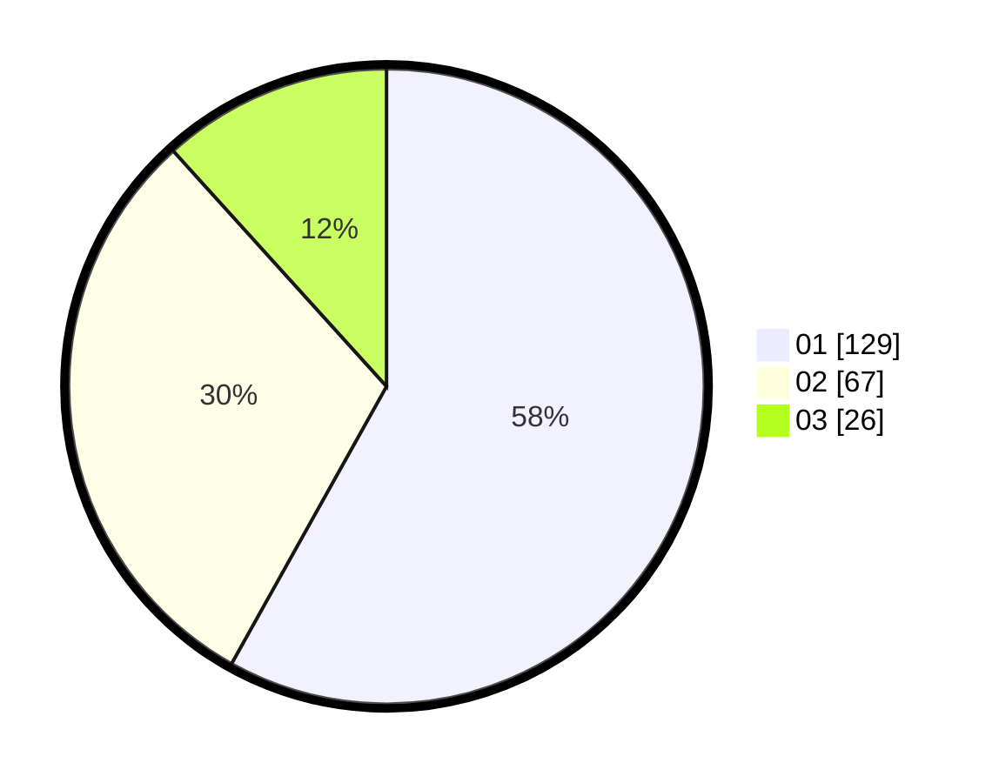

# Hasil

Hasil perolehan suara paslon dapat dilihat pada file paslon-01.txt, paslon-02.txt, dan paslon-03.txt.

Jika tidak ada, artinya data tersebut belum ada pada SIREKAP.

## Perolehan Suara

 * Paslon 01: **129**.
 * Paslon 02: **67**.
 * Paslon 03: **26**.

## Foto C Plano

https://sirekap-obj-formc.kpu.go.id/5548/pemilu/ppwp/31/74/08/10/02/3174081002043-20240219-151216--6873880c-e14f-4f1f-8627-0fe27e99dc86.jpg

https://sirekap-obj-formc.kpu.go.id/5548/pemilu/ppwp/31/74/08/10/02/3174081002043-20240219-130732--30e670e0-07e9-4d04-b478-aa3ba80cfcc5.jpg

https://sirekap-obj-formc.kpu.go.id/5548/pemilu/ppwp/31/74/08/10/02/3174081002043-20240215-013303--9c03698e-e8d0-4dea-b1e0-a9de9e00a4e4.jpg

## DATA PEMILIH TETAP

Jumlah pemilih dalam DPT: **271**.
 * L: **136**.
 * P: **135**.

## DATA PENGGUNA HAK PILIH

Jumlah pengguna hak pilih dalam DPT: **208**.
 * L: **97**.
 * P: **111**.

Jumlah pengguna hak pilih dalam DPTb: **14**.
 * L: **3**.
 * P: **11**.

Jumlah pengguna hak pilih dalam DPK: **1**.
 * L: **0**.
 * P: **1**.

Jumlah pengguna hak pilih: **223**.
 * L: **100**.
 * P: **123**.

## JUMLAH SUARA SAH DAN TIDAK SAH

JUMLAH SELURUH SUARA SAH: **222**.

JUMLAH SUARA TIDAK SAH: **1**.

JUMLAH SELURUH SUARA SAH DAN SUARA TIDAK SAH: **223**.
