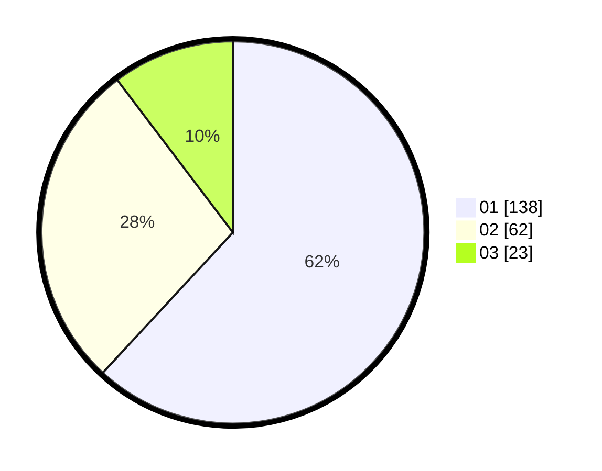

# Hasil

Hasil perolehan suara paslon dapat dilihat pada file paslon-01.txt, paslon-02.txt, dan paslon-03.txt.

Jika tidak ada, artinya data tersebut belum ada pada SIREKAP.

## Perolehan Suara

 * Paslon 01: **138**.
 * Paslon 02: **62**.
 * Paslon 03: **23**.

## Foto C Plano

https://sirekap-obj-formc.kpu.go.id/1cf6/pemilu/ppwp/31/74/08/10/02/3174081002045-20240218-181732--986aa799-96bf-4e29-8bd6-2c68f2934ce6.jpg

https://sirekap-obj-formc.kpu.go.id/1cf6/pemilu/ppwp/31/74/08/10/02/3174081002045-20240218-193620--e6cda705-2015-4962-940c-a3ae12f3923c.jpg

https://sirekap-obj-formc.kpu.go.id/1cf6/pemilu/ppwp/31/74/08/10/02/3174081002045-20240214-202551--9a4cffcb-7fff-4d78-8036-cf457aa2375a.jpg

## DATA PEMILIH TETAP

Jumlah pemilih dalam DPT: **265**.
 * L: **122**.
 * P: **143**.

## DATA PENGGUNA HAK PILIH

Jumlah pengguna hak pilih dalam DPT: **218**.
 * L: **103**.
 * P: **115**.

Jumlah pengguna hak pilih dalam DPTb: **5**.
 * L: **3**.
 * P: **2**.

Jumlah pengguna hak pilih dalam DPK: **3**.
 * L: **2**.
 * P: **1**.

Jumlah pengguna hak pilih: **226**.
 * L: **108**.
 * P: **118**.

## JUMLAH SUARA SAH DAN TIDAK SAH

JUMLAH SELURUH SUARA SAH: **223**.

JUMLAH SUARA TIDAK SAH: **3**.

JUMLAH SELURUH SUARA SAH DAN SUARA TIDAK SAH: **226**.
