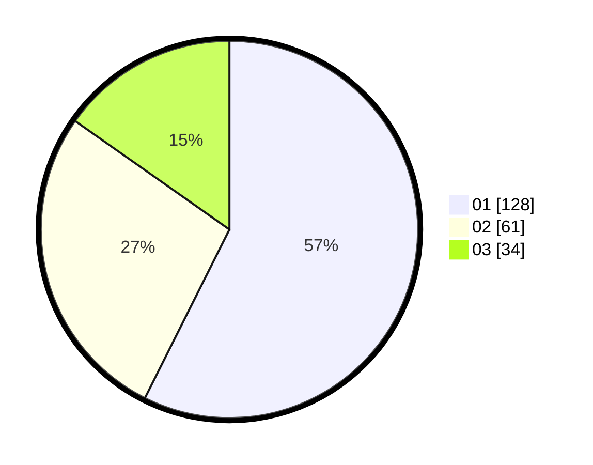

# Hasil

Hasil perolehan suara paslon dapat dilihat pada file paslon-01.txt, paslon-02.txt, dan paslon-03.txt.

Jika tidak ada, artinya data tersebut belum ada pada SIREKAP.

## Perolehan Suara

 * Paslon 01: **128**.
 * Paslon 02: **61**.
 * Paslon 03: **34**.

## Foto C Plano

https://sirekap-obj-formc.kpu.go.id/ba8f/pemilu/ppwp/31/74/08/10/02/3174081002046-20240219-192436--bf0d4b56-3e0d-4878-b228-c07e8eff625b.jpg

https://sirekap-obj-formc.kpu.go.id/ba8f/pemilu/ppwp/31/74/08/10/02/3174081002046-20240219-192236--ec241aa5-935a-4302-83a8-29951e16096a.jpg

https://sirekap-obj-formc.kpu.go.id/ba8f/pemilu/ppwp/31/74/08/10/02/3174081002046-20240219-192848--2a45269f-7b7a-4d84-99bb-5dc26935b8ea.jpg

## DATA PEMILIH TETAP

Jumlah pemilih dalam DPT: **285**.
 * L: **135**.
 * P: **150**.

## DATA PENGGUNA HAK PILIH

Jumlah pengguna hak pilih dalam DPT: **228**.
 * L: **107**.
 * P: **121**.

Jumlah pengguna hak pilih dalam DPTb: **3**.
 * L: **2**.
 * P: **1**.

Jumlah pengguna hak pilih dalam DPK: **3**.
 * L: **1**.
 * P: **2**.

Jumlah pengguna hak pilih: **234**.
 * L: **110**.
 * P: **124**.

## JUMLAH SUARA SAH DAN TIDAK SAH

JUMLAH SELURUH SUARA SAH: **223**.

JUMLAH SUARA TIDAK SAH: **11**.

JUMLAH SELURUH SUARA SAH DAN SUARA TIDAK SAH: **234**.
