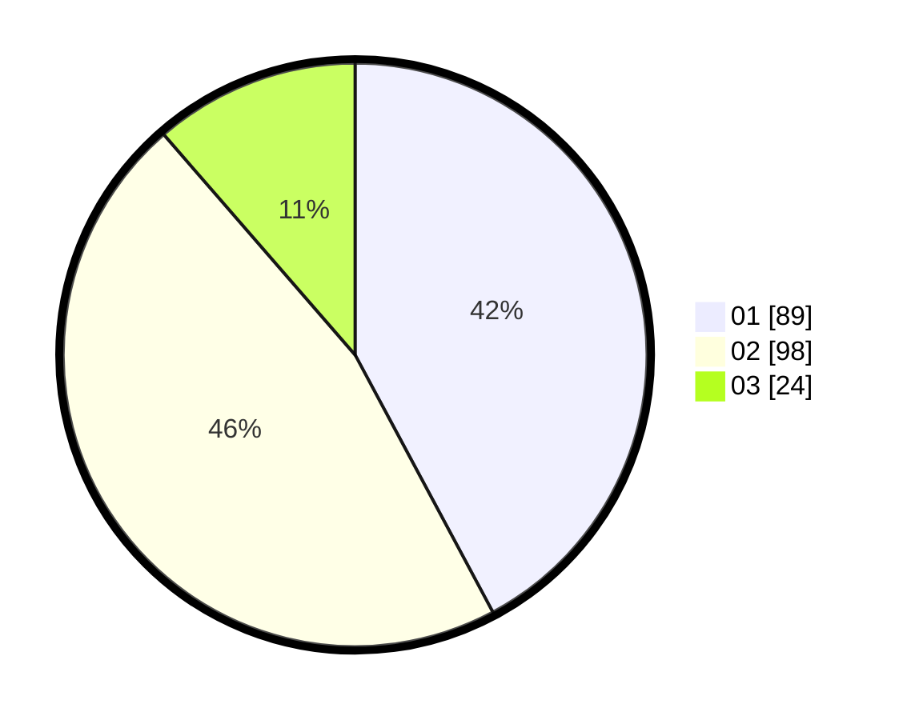

# Hasil

Hasil perolehan suara paslon dapat dilihat pada file paslon-01.txt, paslon-02.txt, dan paslon-03.txt.

Jika tidak ada, artinya data tersebut belum ada pada SIREKAP.

## Perolehan Suara

 * Paslon 01: **89**.
 * Paslon 02: **98**.
 * Paslon 03: **24**.

## Foto C Plano

https://sirekap-obj-formc.kpu.go.id/ea02/pemilu/ppwp/31/74/08/10/02/3174081002047-20240218-152134--1f01cea0-77ef-44c8-9679-252a5f8903af.jpg

https://sirekap-obj-formc.kpu.go.id/ea02/pemilu/ppwp/31/74/08/10/02/3174081002047-20240218-161057--fbcf8a71-010f-4ad1-b1ab-688c644970a3.jpg

https://sirekap-obj-formc.kpu.go.id/ea02/pemilu/ppwp/31/74/08/10/02/3174081002047-20240218-161232--11ae936b-144e-4a88-b8cf-cf2bed64ce48.jpg

## DATA PEMILIH TETAP

Jumlah pemilih dalam DPT: **210**.
 * L: **96**.
 * P: **114**.

## DATA PENGGUNA HAK PILIH

Jumlah pengguna hak pilih dalam DPT: **210**.
 * L: **96**.
 * P: **114**.

Jumlah pengguna hak pilih dalam DPTb: **0**.
 * L: **0**.
 * P: **0**.

Jumlah pengguna hak pilih dalam DPK: **1**.
 * L: **1**.
 * P: **0**.

Jumlah pengguna hak pilih: **211**.
 * L: **97**.
 * P: **114**.

## JUMLAH SUARA SAH DAN TIDAK SAH

JUMLAH SELURUH SUARA SAH: **211**.

JUMLAH SUARA TIDAK SAH: **0**.

JUMLAH SELURUH SUARA SAH DAN SUARA TIDAK SAH: **211**.
