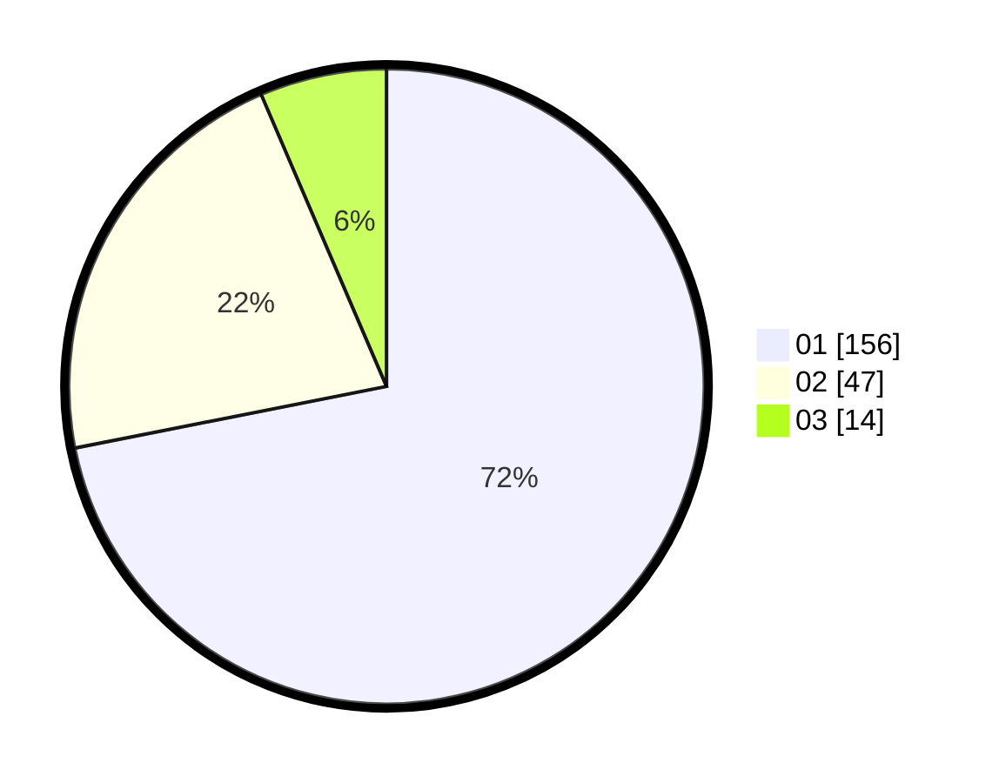

# Hasil

Hasil perolehan suara paslon dapat dilihat pada file paslon-01.txt, paslon-02.txt, dan paslon-03.txt.

Jika tidak ada, artinya data tersebut belum ada pada SIREKAP.

## Perolehan Suara

 * Paslon 01: **156**.
 * Paslon 02: **47**.
 * Paslon 03: **14**.

## Foto C Plano

https://sirekap-obj-formc.kpu.go.id/30ba/pemilu/ppwp/31/74/08/10/02/3174081002050-20240217-190541--3c41b335-9d7b-4b35-9e7b-cb18ad210995.jpg

https://sirekap-obj-formc.kpu.go.id/30ba/pemilu/ppwp/31/74/08/10/02/3174081002050-20240217-191018--edb4ff14-87cf-4ded-aec2-70592036026e.jpg

https://sirekap-obj-formc.kpu.go.id/30ba/pemilu/ppwp/31/74/08/10/02/3174081002050-20240217-191207--57d62c84-33ef-4728-8b13-268d97e350c8.jpg

## DATA PEMILIH TETAP

Jumlah pemilih dalam DPT: **267**.
 * L: **135**.
 * P: **132**.

## DATA PENGGUNA HAK PILIH

Jumlah pengguna hak pilih dalam DPT: **215**.
 * L: **111**.
 * P: **104**.

Jumlah pengguna hak pilih dalam DPTb: **2**.
 * L: **1**.
 * P: **1**.

Jumlah pengguna hak pilih dalam DPK: **5**.
 * L: **2**.
 * P: **3**.

Jumlah pengguna hak pilih: **222**.
 * L: **114**.
 * P: **108**.

## JUMLAH SUARA SAH DAN TIDAK SAH

JUMLAH SELURUH SUARA SAH: **217**.

JUMLAH SUARA TIDAK SAH: **5**.

JUMLAH SELURUH SUARA SAH DAN SUARA TIDAK SAH: **222**.
