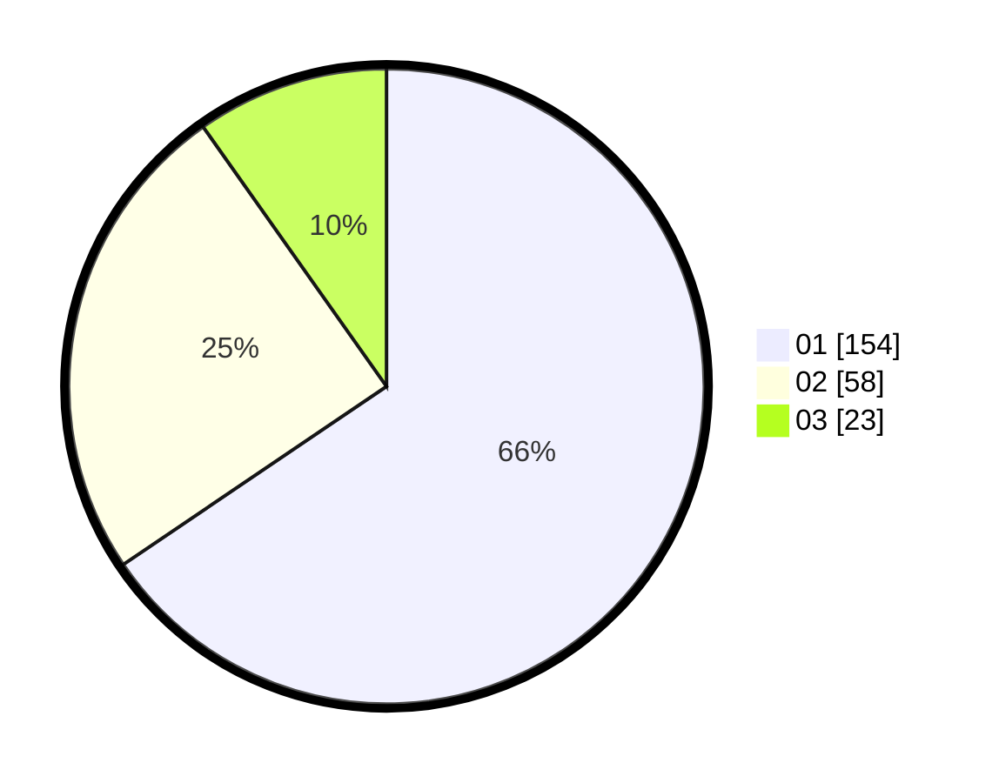

# Hasil

Hasil perolehan suara paslon dapat dilihat pada file paslon-01.txt, paslon-02.txt, dan paslon-03.txt.

Jika tidak ada, artinya data tersebut belum ada pada SIREKAP.

## Perolehan Suara

 * Paslon 01: **154**.
 * Paslon 02: **58**.
 * Paslon 03: **23**.

## Foto C Plano

https://sirekap-obj-formc.kpu.go.id/766b/pemilu/ppwp/31/74/08/10/02/3174081002051-20240214-155400--e6d5cafa-26e4-4bd5-b244-e6fba6dcb4f8.jpg

https://sirekap-obj-formc.kpu.go.id/766b/pemilu/ppwp/31/74/08/10/02/3174081002051-20240214-155208--4e3e69de-9b36-4f7a-8f00-3c682de5e608.jpg

https://sirekap-obj-formc.kpu.go.id/766b/pemilu/ppwp/31/74/08/10/02/3174081002051-20240214-155549--73d47159-b3d4-4f53-a2d3-12fc96f770b9.jpg

## DATA PEMILIH TETAP

Jumlah pemilih dalam DPT: **273**.
 * L: **129**.
 * P: **144**.

## DATA PENGGUNA HAK PILIH

Jumlah pengguna hak pilih dalam DPT: **235**.
 * L: **108**.
 * P: **127**.

Jumlah pengguna hak pilih dalam DPTb: **1**.
 * L: **1**.
 * P: **0**.

Jumlah pengguna hak pilih dalam DPK: **0**.
 * L: **0**.
 * P: **0**.

Jumlah pengguna hak pilih: **236**.
 * L: **109**.
 * P: **127**.

## JUMLAH SUARA SAH DAN TIDAK SAH

JUMLAH SELURUH SUARA SAH: **235**.

JUMLAH SUARA TIDAK SAH: **1**.

JUMLAH SELURUH SUARA SAH DAN SUARA TIDAK SAH: **236**.
