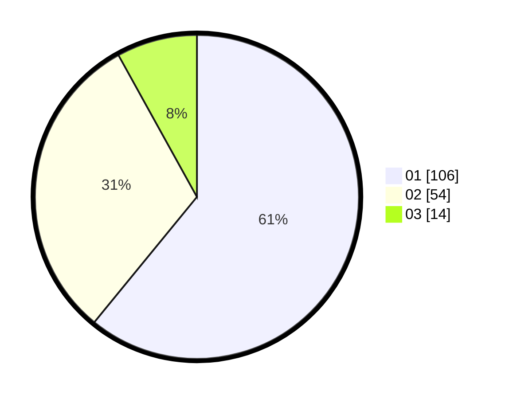

# Hasil

Hasil perolehan suara paslon dapat dilihat pada file paslon-01.txt, paslon-02.txt, dan paslon-03.txt.

Jika tidak ada, artinya data tersebut belum ada pada SIREKAP.

## Perolehan Suara

 * Paslon 01: **106**.
 * Paslon 02: **54**.
 * Paslon 03: **14**.

## Foto C Plano

https://sirekap-obj-formc.kpu.go.id/2d25/pemilu/ppwp/31/74/08/10/02/3174081002053-20240216-175743--6c4a33c6-6b8c-4b54-ac45-166777396f9b.jpg

https://sirekap-obj-formc.kpu.go.id/2d25/pemilu/ppwp/31/74/08/10/02/3174081002053-20240216-175745--7fd782c2-8a0b-4a19-9cc7-4ab4d5bbae3e.jpg

https://sirekap-obj-formc.kpu.go.id/2d25/pemilu/ppwp/31/74/08/10/02/3174081002053-20240216-175744--21e7d2d4-a6b6-40d1-be45-0faa03c11304.jpg

## DATA PEMILIH TETAP

Jumlah pemilih dalam DPT: **231**.
 * L: **111**.
 * P: **120**.

## DATA PENGGUNA HAK PILIH

Jumlah pengguna hak pilih dalam DPT: **174**.
 * L: **82**.
 * P: **92**.

Jumlah pengguna hak pilih dalam DPTb: **2**.
 * L: **0**.
 * P: **2**.

Jumlah pengguna hak pilih dalam DPK: **0**.
 * L: **0**.
 * P: **0**.

Jumlah pengguna hak pilih: **176**.
 * L: **82**.
 * P: **94**.

## JUMLAH SUARA SAH DAN TIDAK SAH

JUMLAH SELURUH SUARA SAH: **174**.

JUMLAH SUARA TIDAK SAH: **2**.

JUMLAH SELURUH SUARA SAH DAN SUARA TIDAK SAH: **176**.
