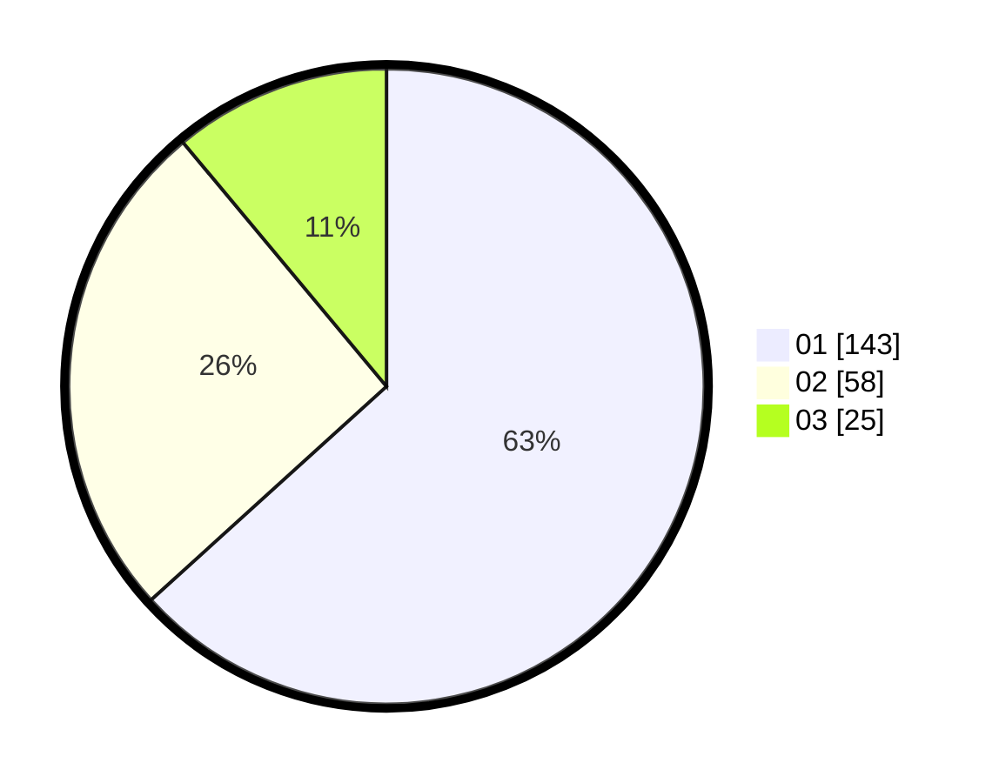

# Hasil

Hasil perolehan suara paslon dapat dilihat pada file paslon-01.txt, paslon-02.txt, dan paslon-03.txt.

Jika tidak ada, artinya data tersebut belum ada pada SIREKAP.

## Perolehan Suara

 * Paslon 01: **143**.
 * Paslon 02: **58**.
 * Paslon 03: **25**.

## Foto C Plano

https://sirekap-obj-formc.kpu.go.id/4c4c/pemilu/ppwp/31/74/08/10/02/3174081002055-20240219-181826--dc91eae6-b032-4421-80eb-b87977e17b37.jpg

https://sirekap-obj-formc.kpu.go.id/4c4c/pemilu/ppwp/31/74/08/10/02/3174081002055-20240217-193423--8e21c752-3a2c-44b7-967f-8d3c04a5abac.jpg

https://sirekap-obj-formc.kpu.go.id/4c4c/pemilu/ppwp/31/74/08/10/02/3174081002055-20240217-193559--4d70c125-4d4a-4646-9e4a-7723351488ae.jpg

## DATA PEMILIH TETAP

Jumlah pemilih dalam DPT: **270**.
 * L: **128**.
 * P: **142**.

## DATA PENGGUNA HAK PILIH

Jumlah pengguna hak pilih dalam DPT: **219**.
 * L: **103**.
 * P: **116**.

Jumlah pengguna hak pilih dalam DPTb: **5**.
 * L: **2**.
 * P: **3**.

Jumlah pengguna hak pilih dalam DPK: **3**.
 * L: **2**.
 * P: **1**.

Jumlah pengguna hak pilih: **227**.
 * L: **107**.
 * P: **120**.

## JUMLAH SUARA SAH DAN TIDAK SAH

JUMLAH SELURUH SUARA SAH: **226**.

JUMLAH SUARA TIDAK SAH: **1**.

JUMLAH SELURUH SUARA SAH DAN SUARA TIDAK SAH: **227**.
