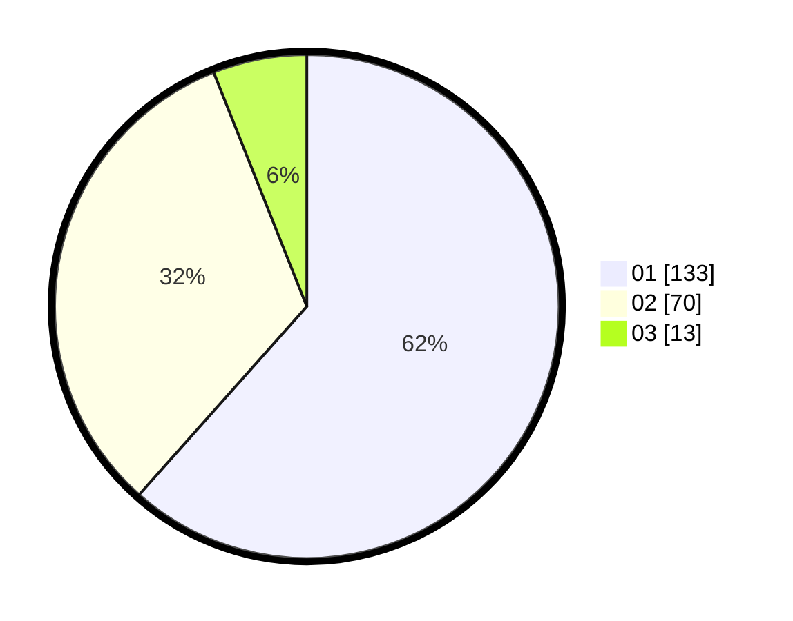

# Hasil

Hasil perolehan suara paslon dapat dilihat pada file paslon-01.txt, paslon-02.txt, dan paslon-03.txt.

Jika tidak ada, artinya data tersebut belum ada pada SIREKAP.

## Perolehan Suara

 * Paslon 01: **133**.
 * Paslon 02: **70**.
 * Paslon 03: **13**.

## Foto C Plano

https://sirekap-obj-formc.kpu.go.id/3d7f/pemilu/ppwp/31/74/08/10/02/3174081002062-20240214-160102--c0a2bb26-66ed-4332-a17a-abaa51607744.jpg

https://sirekap-obj-formc.kpu.go.id/3d7f/pemilu/ppwp/31/74/08/10/02/3174081002062-20240217-214448--b935ec69-11f1-4410-8ffa-fc7157ac48ef.jpg

https://sirekap-obj-formc.kpu.go.id/3d7f/pemilu/ppwp/31/74/08/10/02/3174081002062-20240214-155112--88fb82b7-1dcd-4044-af0d-b0a9b1dc65e3.jpg

## DATA PEMILIH TETAP

Jumlah pemilih dalam DPT: **255**.
 * L: **140**.
 * P: **115**.

## DATA PENGGUNA HAK PILIH

Jumlah pengguna hak pilih dalam DPT: **209**.
 * L: **113**.
 * P: **96**.

Jumlah pengguna hak pilih dalam DPTb: **3**.
 * L: **1**.
 * P: **2**.

Jumlah pengguna hak pilih dalam DPK: **7**.
 * L: **5**.
 * P: **2**.

Jumlah pengguna hak pilih: **219**.
 * L: **119**.
 * P: **100**.

## JUMLAH SUARA SAH DAN TIDAK SAH

JUMLAH SELURUH SUARA SAH: **216**.

JUMLAH SUARA TIDAK SAH: **3**.

JUMLAH SELURUH SUARA SAH DAN SUARA TIDAK SAH: **219**.
