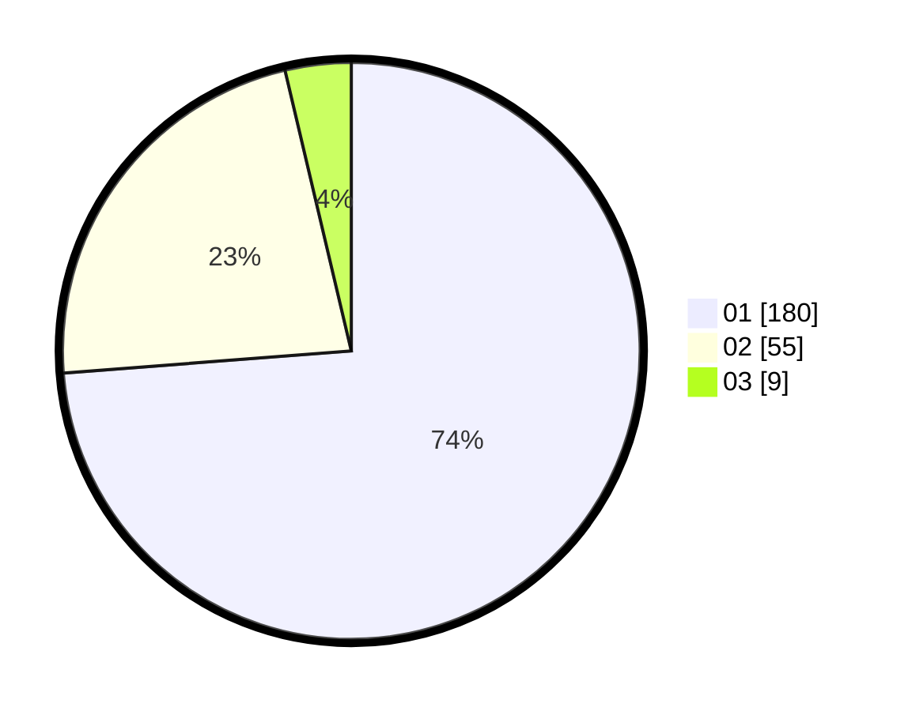

# Hasil

Hasil perolehan suara paslon dapat dilihat pada file paslon-01.txt, paslon-02.txt, dan paslon-03.txt.

Jika tidak ada, artinya data tersebut belum ada pada SIREKAP.

## Perolehan Suara

 * Paslon 01: **180**.
 * Paslon 02: **55**.
 * Paslon 03: **9**.

## Foto C Plano

https://sirekap-obj-formc.kpu.go.id/a64c/pemilu/ppwp/31/74/08/10/02/3174081002064-20240218-140512--f04962e2-b182-4f01-9a2d-fd7707c0bd46.jpg

https://sirekap-obj-formc.kpu.go.id/a64c/pemilu/ppwp/31/74/08/10/02/3174081002064-20240218-140154--9236acf8-2a7b-43a1-9437-0677d565d42c.jpg

https://sirekap-obj-formc.kpu.go.id/a64c/pemilu/ppwp/31/74/08/10/02/3174081002064-20240218-141254--e0335a92-06b7-4702-a098-1fcc9fadcd24.jpg

## DATA PEMILIH TETAP

Jumlah pemilih dalam DPT: **273**.
 * L: **137**.
 * P: **136**.

## DATA PENGGUNA HAK PILIH

Jumlah pengguna hak pilih dalam DPT: **232**.
 * L: **111**.
 * P: **121**.

Jumlah pengguna hak pilih dalam DPTb: **8**.
 * L: **7**.
 * P: **1**.

Jumlah pengguna hak pilih dalam DPK: **5**.
 * L: **4**.
 * P: **1**.

Jumlah pengguna hak pilih: **245**.
 * L: **122**.
 * P: **123**.

## JUMLAH SUARA SAH DAN TIDAK SAH

JUMLAH SELURUH SUARA SAH: **244**.

JUMLAH SUARA TIDAK SAH: **1**.

JUMLAH SELURUH SUARA SAH DAN SUARA TIDAK SAH: **245**.
