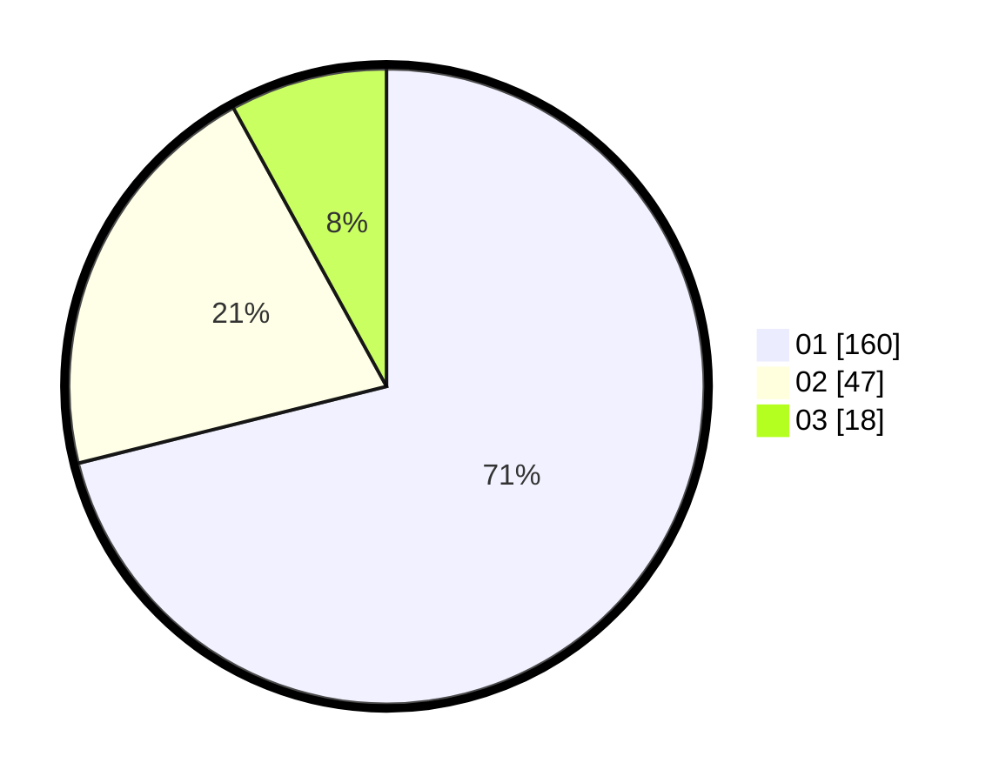

# Hasil

Hasil perolehan suara paslon dapat dilihat pada file paslon-01.txt, paslon-02.txt, dan paslon-03.txt.

Jika tidak ada, artinya data tersebut belum ada pada SIREKAP.

## Perolehan Suara

 * Paslon 01: **160**.
 * Paslon 02: **47**.
 * Paslon 03: **18**.

## Foto C Plano

https://sirekap-obj-formc.kpu.go.id/7d08/pemilu/ppwp/31/74/08/10/02/3174081002065-20240214-235520--5308e788-986d-4872-b1f3-5d4bd0185074.jpg

https://sirekap-obj-formc.kpu.go.id/7d08/pemilu/ppwp/31/74/08/10/02/3174081002065-20240214-235728--9f383875-a3f8-4537-9953-32d7ab5871e6.jpg

https://sirekap-obj-formc.kpu.go.id/7d08/pemilu/ppwp/31/74/08/10/02/3174081002065-20240214-235725--aa13c83d-b3c4-43d8-91e4-9e9c051edfcd.jpg

## DATA PEMILIH TETAP

Jumlah pemilih dalam DPT: **269**.
 * L: **131**.
 * P: **138**.

## DATA PENGGUNA HAK PILIH

Jumlah pengguna hak pilih dalam DPT: **219**.
 * L: **101**.
 * P: **118**.

Jumlah pengguna hak pilih dalam DPTb: **7**.
 * L: **7**.
 * P: **0**.

Jumlah pengguna hak pilih dalam DPK: **1**.
 * L: **1**.
 * P: **0**.

Jumlah pengguna hak pilih: **227**.
 * L: **109**.
 * P: **118**.

## JUMLAH SUARA SAH DAN TIDAK SAH

JUMLAH SELURUH SUARA SAH: **225**.

JUMLAH SUARA TIDAK SAH: **2**.

JUMLAH SELURUH SUARA SAH DAN SUARA TIDAK SAH: **227**.
