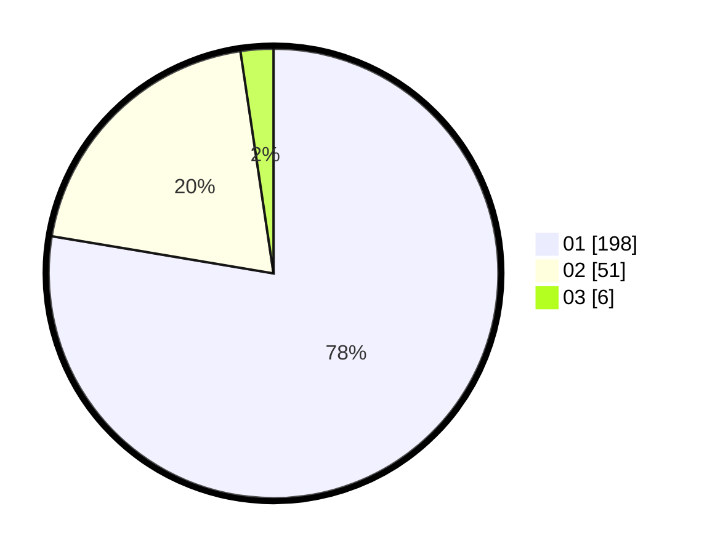

# Hasil

Hasil perolehan suara paslon dapat dilihat pada file paslon-01.txt, paslon-02.txt, dan paslon-03.txt.

Jika tidak ada, artinya data tersebut belum ada pada SIREKAP.

## Perolehan Suara

 * Paslon 01: **198**.
 * Paslon 02: **51**.
 * Paslon 03: **6**.

## Foto C Plano

https://sirekap-obj-formc.kpu.go.id/1003/pemilu/ppwp/31/74/08/10/02/3174081002069-20240214-155059--31212dd2-7697-40ef-aba0-8699b7272ad1.jpg

https://sirekap-obj-formc.kpu.go.id/1003/pemilu/ppwp/31/74/08/10/02/3174081002069-20240214-155133--321b5416-9cd5-4486-aaca-5e46220d839e.jpg

https://sirekap-obj-formc.kpu.go.id/1003/pemilu/ppwp/31/74/08/10/02/3174081002069-20240218-132547--93b41e3c-64d1-4310-bb73-d266ae303671.jpg

## DATA PEMILIH TETAP

Jumlah pemilih dalam DPT: **280**.
 * L: **141**.
 * P: **139**.

## DATA PENGGUNA HAK PILIH

Jumlah pengguna hak pilih dalam DPT: **247**.
 * L: **120**.
 * P: **127**.

Jumlah pengguna hak pilih dalam DPTb: **8**.
 * L: **6**.
 * P: **2**.

Jumlah pengguna hak pilih dalam DPK: **2**.
 * L: **1**.
 * P: **1**.

Jumlah pengguna hak pilih: **257**.
 * L: **127**.
 * P: **130**.

## JUMLAH SUARA SAH DAN TIDAK SAH

JUMLAH SELURUH SUARA SAH: **255**.

JUMLAH SUARA TIDAK SAH: **2**.

JUMLAH SELURUH SUARA SAH DAN SUARA TIDAK SAH: **257**.
