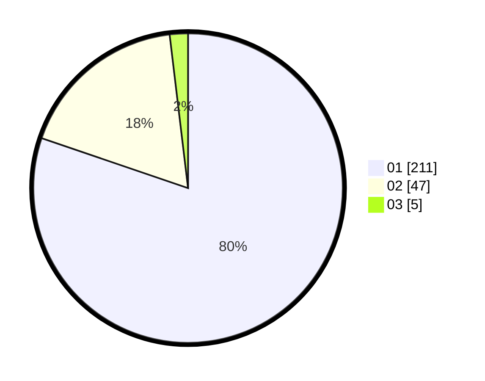

# Hasil

Hasil perolehan suara paslon dapat dilihat pada file paslon-01.txt, paslon-02.txt, dan paslon-03.txt.

Jika tidak ada, artinya data tersebut belum ada pada SIREKAP.

## Perolehan Suara

 * Paslon 01: **211**.
 * Paslon 02: **47**.
 * Paslon 03: **5**.

## Foto C Plano

https://sirekap-obj-formc.kpu.go.id/59db/pemilu/ppwp/31/74/08/10/02/3174081002074-20240216-142230--1ef74d35-dd94-48cf-b5b3-6299818d62d0.jpg

https://sirekap-obj-formc.kpu.go.id/59db/pemilu/ppwp/31/74/08/10/02/3174081002074-20240216-142232--39cd585e-826e-4203-b1c9-161c99938c15.jpg

https://sirekap-obj-formc.kpu.go.id/59db/pemilu/ppwp/31/74/08/10/02/3174081002074-20240216-142231--db72e4be-fdd0-4635-b28f-94442f2ba4f6.jpg

## DATA PEMILIH TETAP

Jumlah pemilih dalam DPT: **0**.
 * L: **0**.
 * P: **0**.

## DATA PENGGUNA HAK PILIH

Jumlah pengguna hak pilih dalam DPT: **0**.
 * L: **0**.
 * P: **0**.

Jumlah pengguna hak pilih dalam DPTb: **0**.
 * L: **0**.
 * P: **0**.

Jumlah pengguna hak pilih dalam DPK: **0**.
 * L: **0**.
 * P: **0**.

Jumlah pengguna hak pilih: **0**.
 * L: **0**.
 * P: **0**.

## JUMLAH SUARA SAH DAN TIDAK SAH

JUMLAH SELURUH SUARA SAH: **263**.

JUMLAH SUARA TIDAK SAH: **2**.

JUMLAH SELURUH SUARA SAH DAN SUARA TIDAK SAH: **265**.
