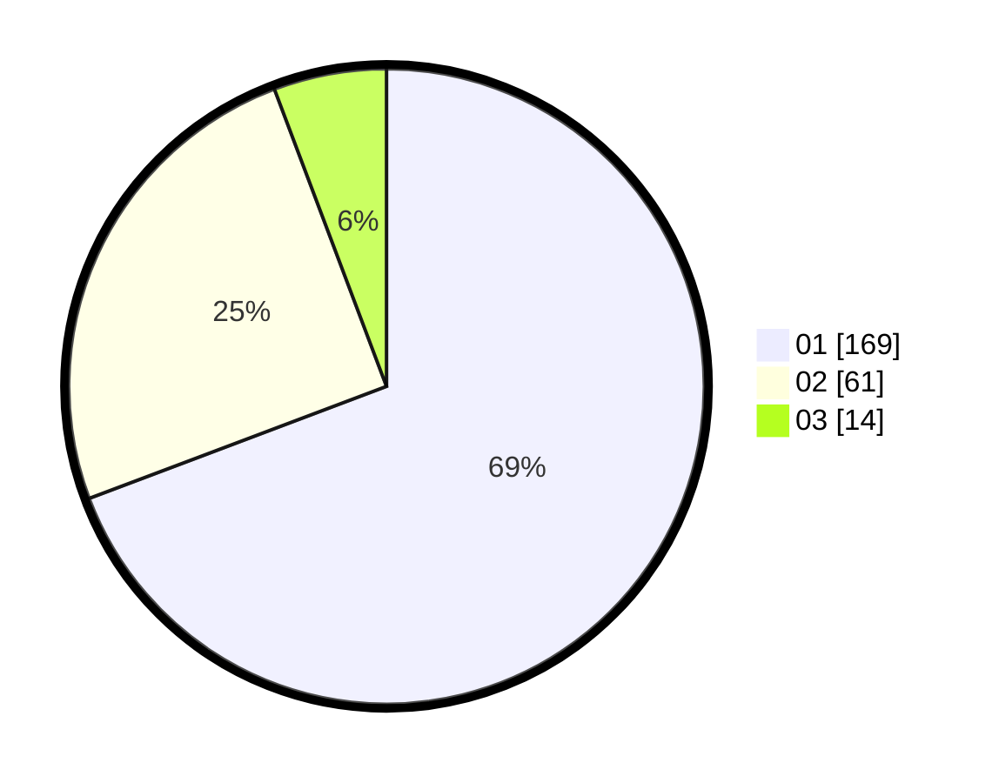

# Hasil

Hasil perolehan suara paslon dapat dilihat pada file paslon-01.txt, paslon-02.txt, dan paslon-03.txt.

Jika tidak ada, artinya data tersebut belum ada pada SIREKAP.

## Perolehan Suara

 * Paslon 01: **169**.
 * Paslon 02: **61**.
 * Paslon 03: **14**.

## Foto C Plano

https://sirekap-obj-formc.kpu.go.id/850e/pemilu/ppwp/31/74/08/10/02/3174081002076-20240214-213402--a7587e8d-e05e-4483-b6cb-82135f48309a.jpg

https://sirekap-obj-formc.kpu.go.id/850e/pemilu/ppwp/31/74/08/10/02/3174081002076-20240214-193640--28cd8fc3-2a41-4f71-a12e-edf06d48c288.jpg

https://sirekap-obj-formc.kpu.go.id/850e/pemilu/ppwp/31/74/08/10/02/3174081002076-20240214-191456--484a48e5-3da8-4f98-a4ed-c654240ffd74.jpg

## DATA PEMILIH TETAP

Jumlah pemilih dalam DPT: **293**.
 * L: **136**.
 * P: **157**.

## DATA PENGGUNA HAK PILIH

Jumlah pengguna hak pilih dalam DPT: **243**.
 * L: **117**.
 * P: **126**.

Jumlah pengguna hak pilih dalam DPTb: **1**.
 * L: **0**.
 * P: **1**.

Jumlah pengguna hak pilih dalam DPK: **0**.
 * L: **0**.
 * P: **0**.

Jumlah pengguna hak pilih: **244**.
 * L: **117**.
 * P: **127**.

## JUMLAH SUARA SAH DAN TIDAK SAH

JUMLAH SELURUH SUARA SAH: **244**.

JUMLAH SUARA TIDAK SAH: **0**.

JUMLAH SELURUH SUARA SAH DAN SUARA TIDAK SAH: **244**.
