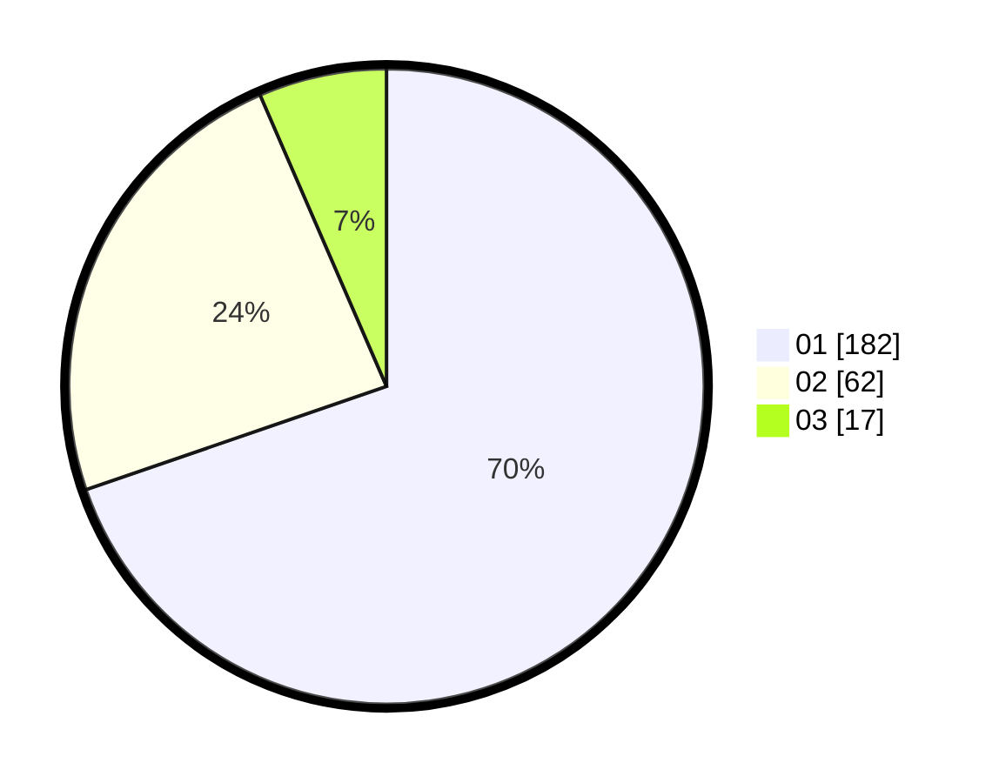

# Hasil

Hasil perolehan suara paslon dapat dilihat pada file paslon-01.txt, paslon-02.txt, dan paslon-03.txt.

Jika tidak ada, artinya data tersebut belum ada pada SIREKAP.

## Perolehan Suara

 * Paslon 01: **182**.
 * Paslon 02: **62**.
 * Paslon 03: **17**.

## Foto C Plano

https://sirekap-obj-formc.kpu.go.id/48da/pemilu/ppwp/31/74/08/10/02/3174081002081-20240214-190811--80210976-f5bc-4985-85cc-b37c9e966e3c.jpg

https://sirekap-obj-formc.kpu.go.id/48da/pemilu/ppwp/31/74/08/10/02/3174081002081-20240214-190051--3ac9b6a2-d36b-4f49-a48a-d18952365e3a.jpg

https://sirekap-obj-formc.kpu.go.id/48da/pemilu/ppwp/31/74/08/10/02/3174081002081-20240214-185811--e13961e6-6b7c-4b17-81ef-3f646f4fbd6f.jpg

## DATA PEMILIH TETAP

Jumlah pemilih dalam DPT: **295**.
 * L: **158**.
 * P: **137**.

## DATA PENGGUNA HAK PILIH

Jumlah pengguna hak pilih dalam DPT: **256**.
 * L: **132**.
 * P: **124**.

Jumlah pengguna hak pilih dalam DPTb: **7**.
 * L: **3**.
 * P: **4**.

Jumlah pengguna hak pilih dalam DPK: **3**.
 * L: **1**.
 * P: **2**.

Jumlah pengguna hak pilih: **266**.
 * L: **136**.
 * P: **130**.

## JUMLAH SUARA SAH DAN TIDAK SAH

JUMLAH SELURUH SUARA SAH: **261**.

JUMLAH SUARA TIDAK SAH: **5**.

JUMLAH SELURUH SUARA SAH DAN SUARA TIDAK SAH: **266**.
