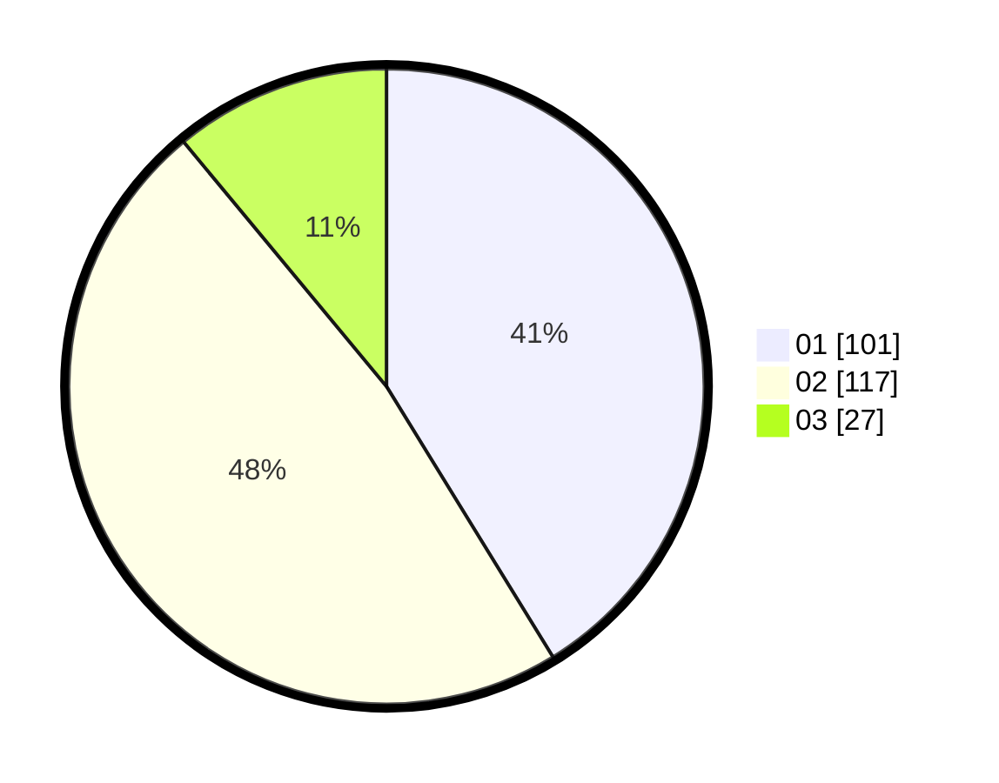

# Hasil

Hasil perolehan suara paslon dapat dilihat pada file paslon-01.txt, paslon-02.txt, dan paslon-03.txt.

Jika tidak ada, artinya data tersebut belum ada pada SIREKAP.

## Perolehan Suara

 * Paslon 01: **101**.
 * Paslon 02: **117**.
 * Paslon 03: **27**.

## Foto C Plano

https://sirekap-obj-formc.kpu.go.id/8733/pemilu/ppwp/31/74/08/10/02/3174081002090-20240214-210023--1aa65b93-060f-4978-95ca-1480b7bcbecc.jpg

https://sirekap-obj-formc.kpu.go.id/8733/pemilu/ppwp/31/74/08/10/02/3174081002090-20240214-210229--4ac47cbe-5c27-4332-aec9-fdf33d0910dc.jpg

https://sirekap-obj-formc.kpu.go.id/8733/pemilu/ppwp/31/74/08/10/02/3174081002090-20240219-104058--8d7496c2-dd18-4ca9-9dee-523d2ca8a86a.jpg

## DATA PEMILIH TETAP

Jumlah pemilih dalam DPT: **299**.
 * L: **123**.
 * P: **176**.

## DATA PENGGUNA HAK PILIH

Jumlah pengguna hak pilih dalam DPT: **244**.
 * L: **94**.
 * P: **150**.

Jumlah pengguna hak pilih dalam DPTb: **2**.
 * L: **1**.
 * P: **1**.

Jumlah pengguna hak pilih dalam DPK: **3**.
 * L: **2**.
 * P: **1**.

Jumlah pengguna hak pilih: **249**.
 * L: **97**.
 * P: **152**.

## JUMLAH SUARA SAH DAN TIDAK SAH

JUMLAH SELURUH SUARA SAH: **245**.

JUMLAH SUARA TIDAK SAH: **4**.

JUMLAH SELURUH SUARA SAH DAN SUARA TIDAK SAH: **249**.
