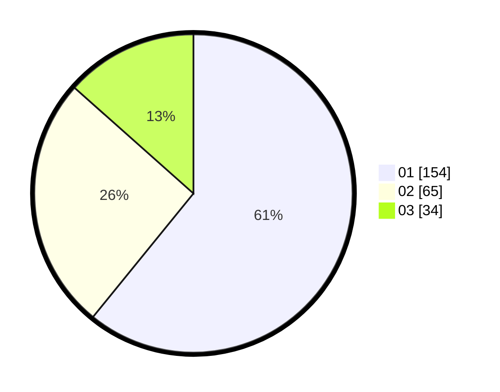

# Hasil

Hasil perolehan suara paslon dapat dilihat pada file paslon-01.txt, paslon-02.txt, dan paslon-03.txt.

Jika tidak ada, artinya data tersebut belum ada pada SIREKAP.

## Perolehan Suara

 * Paslon 01: **154**.
 * Paslon 02: **65**.
 * Paslon 03: **34**.

## Foto C Plano

https://sirekap-obj-formc.kpu.go.id/5a2d/pemilu/ppwp/31/74/08/10/02/3174081002100-20240214-212827--5726e35a-0b6a-48f4-bd35-2c77a6cad857.jpg

https://sirekap-obj-formc.kpu.go.id/5a2d/pemilu/ppwp/31/74/08/10/02/3174081002100-20240214-201438--09a9617d-c4c6-4731-b074-4d9f0ac80145.jpg

https://sirekap-obj-formc.kpu.go.id/5a2d/pemilu/ppwp/31/74/08/10/02/3174081002100-20240214-205301--8bba7748-ff4d-4678-9709-ae73eac41ce1.jpg
