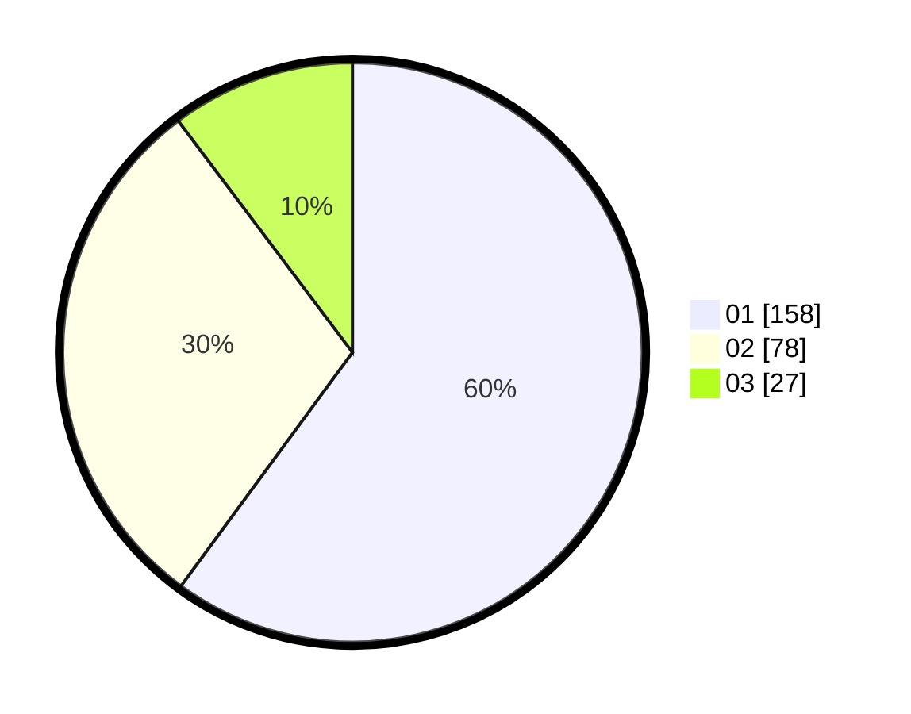

# Hasil

Hasil perolehan suara paslon dapat dilihat pada file paslon-01.txt, paslon-02.txt, dan paslon-03.txt.

Jika tidak ada, artinya data tersebut belum ada pada SIREKAP.

## Perolehan Suara

 * Paslon 01: **158**.
 * Paslon 02: **78**.
 * Paslon 03: **27**.

## Foto C Plano

https://sirekap-obj-formc.kpu.go.id/b986/pemilu/ppwp/31/74/08/10/02/3174081002103-20240214-202750--c0490b89-7fd2-431f-be7f-8e688d881ab3.jpg

https://sirekap-obj-formc.kpu.go.id/b986/pemilu/ppwp/31/74/08/10/02/3174081002103-20240214-202801--74b875f7-9b38-4c2a-96ae-c47a53ab27da.jpg

https://sirekap-obj-formc.kpu.go.id/b986/pemilu/ppwp/31/74/08/10/02/3174081002103-20240214-202808--e5368bbb-8d7d-4bca-b216-754dac722fa4.jpg

## DATA PEMILIH TETAP

Jumlah pemilih dalam DPT: **284**.
 * L: **135**.
 * P: **149**.

## DATA PENGGUNA HAK PILIH

Jumlah pengguna hak pilih dalam DPT: **249**.
 * L: **115**.
 * P: **134**.

Jumlah pengguna hak pilih dalam DPTb: **12**.
 * L: **6**.
 * P: **6**.

Jumlah pengguna hak pilih dalam DPK: **1**.
 * L: **0**.
 * P: **1**.

Jumlah pengguna hak pilih: **262**.
 * L: **121**.
 * P: **141**.

## JUMLAH SUARA SAH DAN TIDAK SAH

JUMLAH SELURUH SUARA SAH: **258**.

JUMLAH SUARA TIDAK SAH: **4**.

JUMLAH SELURUH SUARA SAH DAN SUARA TIDAK SAH: **262**.
