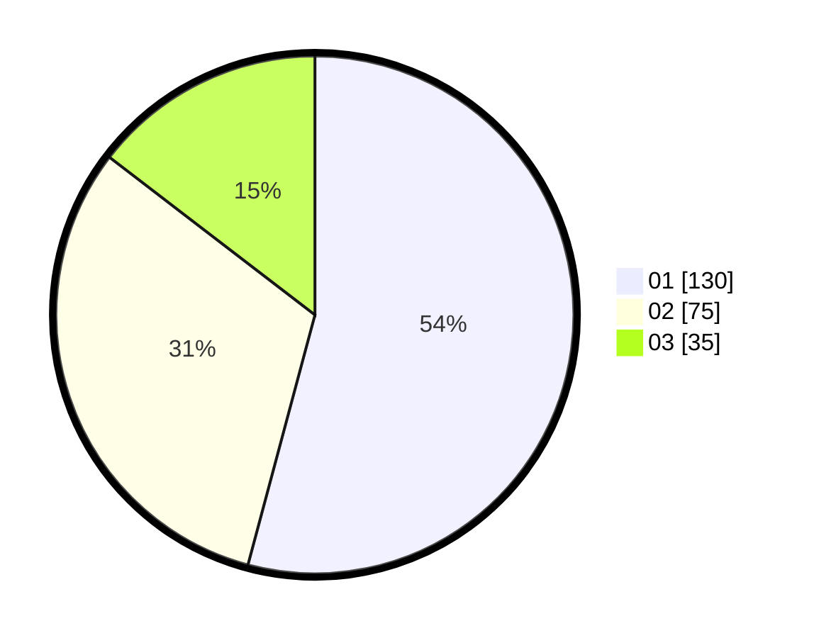

# Hasil

Hasil perolehan suara paslon dapat dilihat pada file paslon-01.txt, paslon-02.txt, dan paslon-03.txt.

Jika tidak ada, artinya data tersebut belum ada pada SIREKAP.

## Perolehan Suara

 * Paslon 01: **130**.
 * Paslon 02: **75**.
 * Paslon 03: **35**.

## Foto C Plano

https://sirekap-obj-formc.kpu.go.id/aeab/pemilu/ppwp/31/74/08/10/02/3174081002110-20240215-005644--88b155df-8305-435a-ab7d-d678a3ef756e.jpg

https://sirekap-obj-formc.kpu.go.id/aeab/pemilu/ppwp/31/74/08/10/02/3174081002110-20240215-005724--d804f46d-40c5-4644-8127-cdb37fc04974.jpg

https://sirekap-obj-formc.kpu.go.id/aeab/pemilu/ppwp/31/74/08/10/02/3174081002110-20240215-005913--ff2ebd64-17dc-416e-ace5-dbaa72788cbb.jpg
