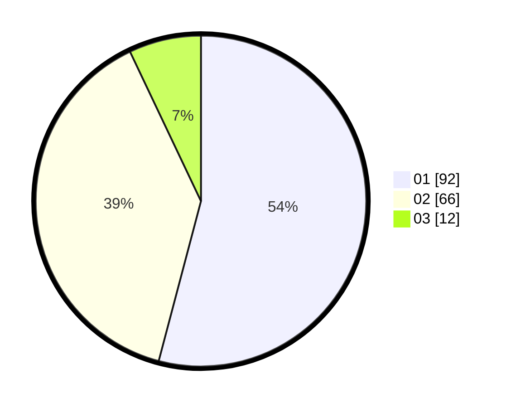

# Hasil

Hasil perolehan suara paslon dapat dilihat pada file paslon-01.txt, paslon-02.txt, dan paslon-03.txt.

Jika tidak ada, artinya data tersebut belum ada pada SIREKAP.

## Perolehan Suara

 * Paslon 01: **92**.
 * Paslon 02: **66**.
 * Paslon 03: **12**.

## Foto C Plano

https://sirekap-obj-formc.kpu.go.id/3b5a/pemilu/ppwp/31/74/08/10/02/3174081002111-20240214-204157--d9565b6d-3034-4e4c-97a5-a972945b0084.jpg

https://sirekap-obj-formc.kpu.go.id/3b5a/pemilu/ppwp/31/74/08/10/02/3174081002111-20240214-204344--f91d4bad-26dd-4428-af1a-b92d855bbd26.jpg

https://sirekap-obj-formc.kpu.go.id/3b5a/pemilu/ppwp/31/74/08/10/02/3174081002111-20240214-204423--fad6ef60-6429-4529-a3ac-2fa6eaf82fd7.jpg

## DATA PEMILIH TETAP

Jumlah pemilih dalam DPT: **233**.
 * L: **114**.
 * P: **119**.

## DATA PENGGUNA HAK PILIH

Jumlah pengguna hak pilih dalam DPT: **170**.
 * L: **74**.
 * P: **96**.

Jumlah pengguna hak pilih dalam DPTb: **1**.
 * L: **0**.
 * P: **1**.

Jumlah pengguna hak pilih dalam DPK: **1**.
 * L: **0**.
 * P: **1**.

Jumlah pengguna hak pilih: **172**.
 * L: **74**.
 * P: **98**.

## JUMLAH SUARA SAH DAN TIDAK SAH

JUMLAH SELURUH SUARA SAH: **170**.

JUMLAH SUARA TIDAK SAH: **2**.

JUMLAH SELURUH SUARA SAH DAN SUARA TIDAK SAH: **172**.
