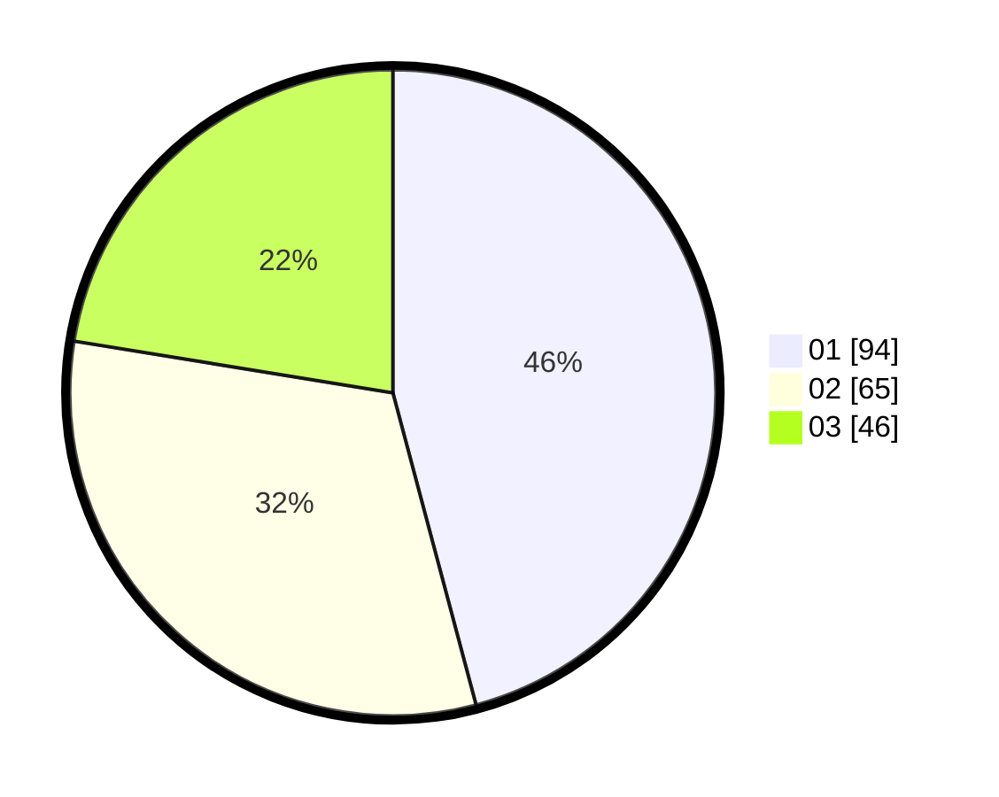

# Hasil

Hasil perolehan suara paslon dapat dilihat pada file paslon-01.txt, paslon-02.txt, dan paslon-03.txt.

Jika tidak ada, artinya data tersebut belum ada pada SIREKAP.

## Perolehan Suara

 * Paslon 01: **94**.
 * Paslon 02: **65**.
 * Paslon 03: **46**.

## Foto C Plano

https://sirekap-obj-formc.kpu.go.id/0b44/pemilu/ppwp/31/74/08/10/02/3174081002112-20240218-210107--13e1cb58-6020-4248-b36d-eaa03946ea51.jpg

https://sirekap-obj-formc.kpu.go.id/0b44/pemilu/ppwp/31/74/08/10/02/3174081002112-20240218-223104--3c66ea7c-ee49-463a-b6ba-fe1f4d560abc.jpg

https://sirekap-obj-formc.kpu.go.id/0b44/pemilu/ppwp/31/74/08/10/02/3174081002112-20240218-223103--1028b962-bdc0-4117-889a-3027bff38664.jpg

## DATA PEMILIH TETAP

Jumlah pemilih dalam DPT: **252**.
 * L: **130**.
 * P: **122**.

## DATA PENGGUNA HAK PILIH

Jumlah pengguna hak pilih dalam DPT: **204**.
 * L: **101**.
 * P: **103**.

Jumlah pengguna hak pilih dalam DPTb: **3**.
 * L: **2**.
 * P: **1**.

Jumlah pengguna hak pilih dalam DPK: **1**.
 * L: **1**.
 * P: **0**.

Jumlah pengguna hak pilih: **208**.
 * L: **104**.
 * P: **104**.

## JUMLAH SUARA SAH DAN TIDAK SAH

JUMLAH SELURUH SUARA SAH: **205**.

JUMLAH SUARA TIDAK SAH: **3**.

JUMLAH SELURUH SUARA SAH DAN SUARA TIDAK SAH: **208**.
