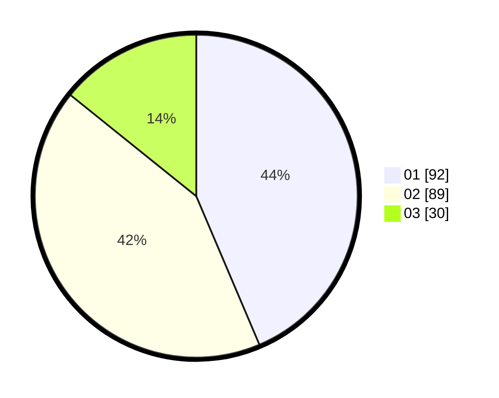

# Hasil

Hasil perolehan suara paslon dapat dilihat pada file paslon-01.txt, paslon-02.txt, dan paslon-03.txt.

Jika tidak ada, artinya data tersebut belum ada pada SIREKAP.

## Perolehan Suara

 * Paslon 01: **92**.
 * Paslon 02: **89**.
 * Paslon 03: **30**.

## Foto C Plano

https://sirekap-obj-formc.kpu.go.id/e419/pemilu/ppwp/31/74/08/10/02/3174081002113-20240214-231257--7a0734c1-8a7d-491e-b5a6-8582615ae34c.jpg

https://sirekap-obj-formc.kpu.go.id/e419/pemilu/ppwp/31/74/08/10/02/3174081002113-20240217-182924--24a531c0-fa7f-4744-888b-41bb908d060a.jpg

https://sirekap-obj-formc.kpu.go.id/e419/pemilu/ppwp/31/74/08/10/02/3174081002113-20240217-182831--d3b3dffe-8df6-4f2c-8943-ac76e2246662.jpg

## DATA PEMILIH TETAP

Jumlah pemilih dalam DPT: **269**.
 * L: **132**.
 * P: **137**.

## DATA PENGGUNA HAK PILIH

Jumlah pengguna hak pilih dalam DPT: **215**.
 * L: **100**.
 * P: **115**.

Jumlah pengguna hak pilih dalam DPTb: **0**.
 * L: **0**.
 * P: **0**.

Jumlah pengguna hak pilih dalam DPK: **1**.
 * L: **1**.
 * P: **0**.

Jumlah pengguna hak pilih: **216**.
 * L: **101**.
 * P: **115**.

## JUMLAH SUARA SAH DAN TIDAK SAH

JUMLAH SELURUH SUARA SAH: **211**.

JUMLAH SUARA TIDAK SAH: **5**.

JUMLAH SELURUH SUARA SAH DAN SUARA TIDAK SAH: **216**.
