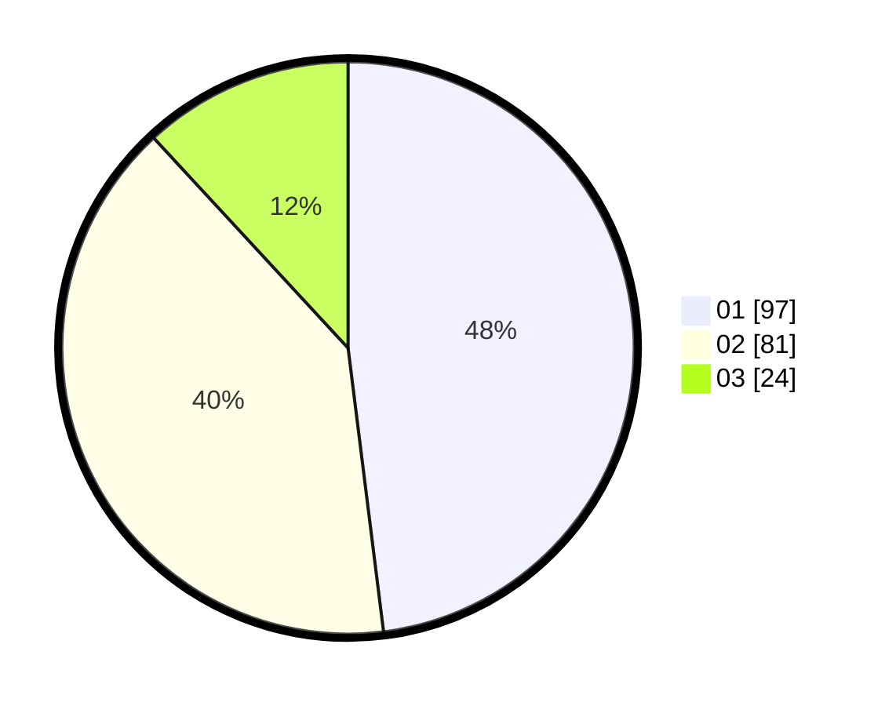

# Hasil

Hasil perolehan suara paslon dapat dilihat pada file paslon-01.txt, paslon-02.txt, dan paslon-03.txt.

Jika tidak ada, artinya data tersebut belum ada pada SIREKAP.

## Perolehan Suara

 * Paslon 01: **97**.
 * Paslon 02: **81**.
 * Paslon 03: **24**.

## Foto C Plano

https://sirekap-obj-formc.kpu.go.id/b158/pemilu/ppwp/31/74/08/10/02/3174081002114-20240214-155751--24be0b85-8fae-4303-bcee-f290af163cb6.jpg

https://sirekap-obj-formc.kpu.go.id/b158/pemilu/ppwp/31/74/08/10/02/3174081002114-20240214-231839--4ab2e781-41fc-47fe-b2d7-76fcffc125f7.jpg

https://sirekap-obj-formc.kpu.go.id/b158/pemilu/ppwp/31/74/08/10/02/3174081002114-20240214-160056--122eaa82-d3ca-4423-ba2b-e00d8569b285.jpg

## DATA PEMILIH TETAP

Jumlah pemilih dalam DPT: **235**.
 * L: **113**.
 * P: **122**.

## DATA PENGGUNA HAK PILIH

Jumlah pengguna hak pilih dalam DPT: **197**.
 * L: **92**.
 * P: **105**.

Jumlah pengguna hak pilih dalam DPTb: **3**.
 * L: **1**.
 * P: **2**.

Jumlah pengguna hak pilih dalam DPK: **3**.
 * L: **2**.
 * P: **1**.

Jumlah pengguna hak pilih: **203**.
 * L: **95**.
 * P: **108**.

## JUMLAH SUARA SAH DAN TIDAK SAH

JUMLAH SELURUH SUARA SAH: **202**.

JUMLAH SUARA TIDAK SAH: **1**.

JUMLAH SELURUH SUARA SAH DAN SUARA TIDAK SAH: **203**.
