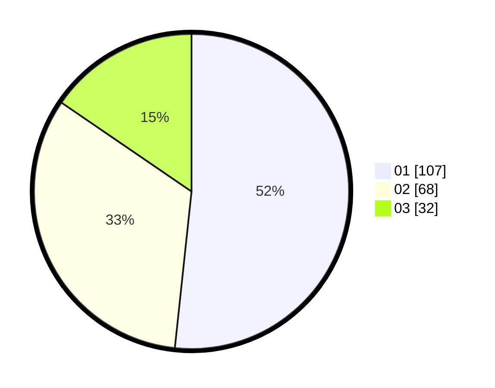

# Hasil

Hasil perolehan suara paslon dapat dilihat pada file paslon-01.txt, paslon-02.txt, dan paslon-03.txt.

Jika tidak ada, artinya data tersebut belum ada pada SIREKAP.

## Perolehan Suara

 * Paslon 01: **107**.
 * Paslon 02: **68**.
 * Paslon 03: **32**.

## Foto C Plano

https://sirekap-obj-formc.kpu.go.id/d995/pemilu/ppwp/31/74/08/10/02/3174081002118-20240219-012412--e3de95e2-3586-4a0e-8bab-dba6d0ec792b.jpg

https://sirekap-obj-formc.kpu.go.id/d995/pemilu/ppwp/31/74/08/10/02/3174081002118-20240217-151855--148724a7-5330-4af2-a5b3-661fb3be89b8.jpg

https://sirekap-obj-formc.kpu.go.id/d995/pemilu/ppwp/31/74/08/10/02/3174081002118-20240217-195752--f7caab5e-fce2-46ee-8ef5-3289f582bae7.jpg

## DATA PEMILIH TETAP

Jumlah pemilih dalam DPT: **260**.
 * L: **129**.
 * P: **131**.

## DATA PENGGUNA HAK PILIH

Jumlah pengguna hak pilih dalam DPT: **207**.
 * L: **101**.
 * P: **106**.

Jumlah pengguna hak pilih dalam DPTb: **3**.
 * L: **2**.
 * P: **1**.

Jumlah pengguna hak pilih dalam DPK: **2**.
 * L: **1**.
 * P: **1**.

Jumlah pengguna hak pilih: **212**.
 * L: **104**.
 * P: **108**.

## JUMLAH SUARA SAH DAN TIDAK SAH

JUMLAH SELURUH SUARA SAH: **207**.

JUMLAH SUARA TIDAK SAH: **5**.

JUMLAH SELURUH SUARA SAH DAN SUARA TIDAK SAH: **212**.
