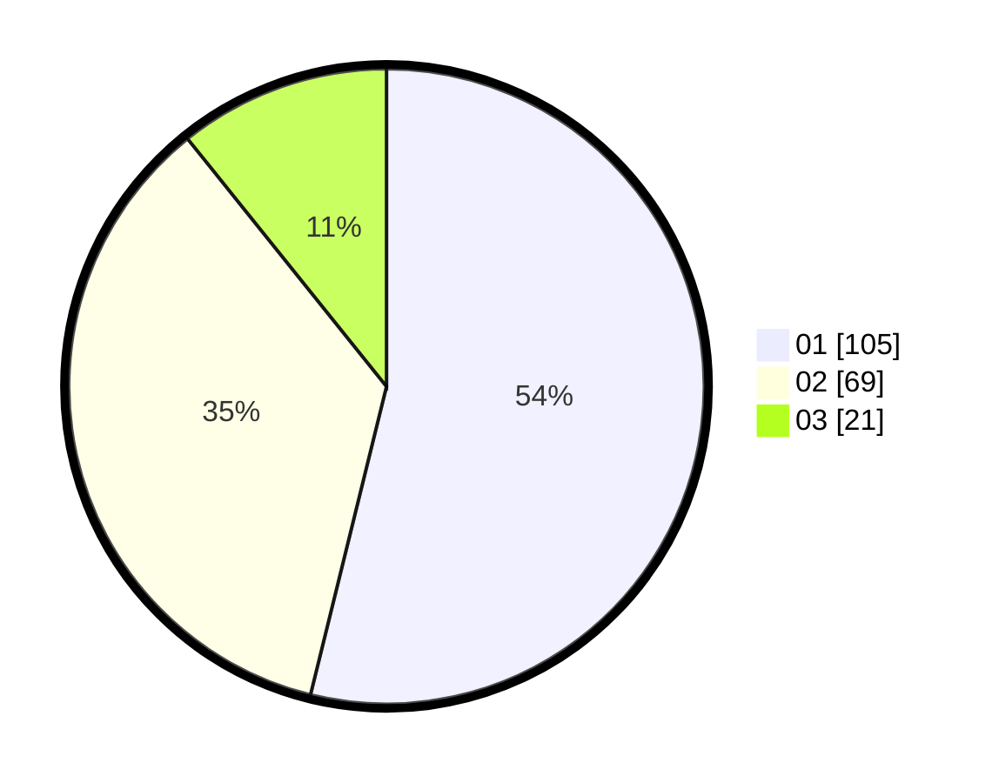

# Hasil

Hasil perolehan suara paslon dapat dilihat pada file paslon-01.txt, paslon-02.txt, dan paslon-03.txt.

Jika tidak ada, artinya data tersebut belum ada pada SIREKAP.

## Perolehan Suara

 * Paslon 01: **105**.
 * Paslon 02: **69**.
 * Paslon 03: **21**.

## Foto C Plano

https://sirekap-obj-formc.kpu.go.id/6d3a/pemilu/ppwp/31/74/08/10/02/3174081002132-20240214-200136--50acb96a-8ccd-48bd-a8be-6b140bf9d4e8.jpg

https://sirekap-obj-formc.kpu.go.id/6d3a/pemilu/ppwp/31/74/08/10/02/3174081002132-20240214-195730--f69042fc-a053-483c-a3f6-df0d5d62e0ea.jpg

https://sirekap-obj-formc.kpu.go.id/6d3a/pemilu/ppwp/31/74/08/10/02/3174081002132-20240214-200351--ff3f5eed-1152-468f-ac4d-94b94f3ad278.jpg

## DATA PEMILIH TETAP

Jumlah pemilih dalam DPT: **254**.
 * L: **126**.
 * P: **128**.

## DATA PENGGUNA HAK PILIH

Jumlah pengguna hak pilih dalam DPT: **197**.
 * L: **96**.
 * P: **101**.

Jumlah pengguna hak pilih dalam DPTb: **0**.
 * L: **0**.
 * P: **0**.

Jumlah pengguna hak pilih dalam DPK: **3**.
 * L: **0**.
 * P: **3**.

Jumlah pengguna hak pilih: **200**.
 * L: **96**.
 * P: **104**.

## JUMLAH SUARA SAH DAN TIDAK SAH

JUMLAH SELURUH SUARA SAH: **195**.

JUMLAH SUARA TIDAK SAH: **5**.

JUMLAH SELURUH SUARA SAH DAN SUARA TIDAK SAH: **200**.
