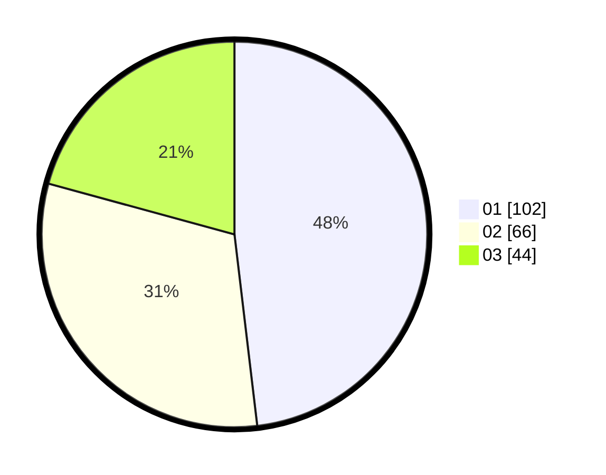

# Hasil

Hasil perolehan suara paslon dapat dilihat pada file paslon-01.txt, paslon-02.txt, dan paslon-03.txt.

Jika tidak ada, artinya data tersebut belum ada pada SIREKAP.

## Perolehan Suara

 * Paslon 01: **102**.
 * Paslon 02: **66**.
 * Paslon 03: **44**.

## Foto C Plano

https://sirekap-obj-formc.kpu.go.id/e1b0/pemilu/ppwp/31/74/08/10/02/3174081002137-20240215-214633--4cb86cef-8caf-4def-bbaf-933f39756926.jpg

https://sirekap-obj-formc.kpu.go.id/e1b0/pemilu/ppwp/31/74/08/10/02/3174081002137-20240215-214635--137f4acb-fd54-40b4-87f3-6bcdc2eae552.jpg

https://sirekap-obj-formc.kpu.go.id/e1b0/pemilu/ppwp/31/74/08/10/02/3174081002137-20240215-214634--1566cab9-2d2f-4b05-8be1-c579a03bbec2.jpg

## DATA PEMILIH TETAP

Jumlah pemilih dalam DPT: **258**.
 * L: **125**.
 * P: **133**.

## DATA PENGGUNA HAK PILIH

Jumlah pengguna hak pilih dalam DPT: **210**.
 * L: **100**.
 * P: **110**.

Jumlah pengguna hak pilih dalam DPTb: **5**.
 * L: **3**.
 * P: **2**.

Jumlah pengguna hak pilih dalam DPK: **4**.
 * L: **2**.
 * P: **2**.

Jumlah pengguna hak pilih: **219**.
 * L: **105**.
 * P: **114**.

## JUMLAH SUARA SAH DAN TIDAK SAH

JUMLAH SELURUH SUARA SAH: **212**.

JUMLAH SUARA TIDAK SAH: **7**.

JUMLAH SELURUH SUARA SAH DAN SUARA TIDAK SAH: **219**.
