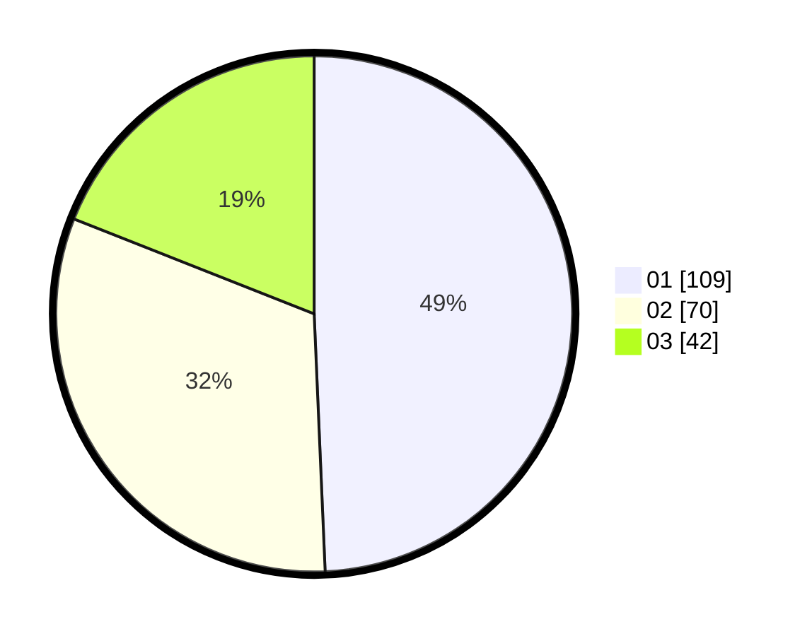

# Hasil

Hasil perolehan suara paslon dapat dilihat pada file paslon-01.txt, paslon-02.txt, dan paslon-03.txt.

Jika tidak ada, artinya data tersebut belum ada pada SIREKAP.

## Perolehan Suara

 * Paslon 01: **109**.
 * Paslon 02: **70**.
 * Paslon 03: **42**.

## Foto C Plano

https://sirekap-obj-formc.kpu.go.id/1a21/pemilu/ppwp/31/74/08/10/02/3174081002141-20240218-205456--fdd8c4a2-39b7-48ea-b7b9-2db081b1373b.jpg

https://sirekap-obj-formc.kpu.go.id/1a21/pemilu/ppwp/31/74/08/10/02/3174081002141-20240218-205457--367e3496-5a18-42dd-a52c-0e97fe21720c.jpg

https://sirekap-obj-formc.kpu.go.id/1a21/pemilu/ppwp/31/74/08/10/02/3174081002141-20240218-205456--d141fd6f-e14e-4c22-b94d-44f5d3c204ec.jpg

## DATA PEMILIH TETAP

Jumlah pemilih dalam DPT: **277**.
 * L: **140**.
 * P: **137**.

## DATA PENGGUNA HAK PILIH

Jumlah pengguna hak pilih dalam DPT: **225**.
 * L: **110**.
 * P: **115**.

Jumlah pengguna hak pilih dalam DPTb: **0**.
 * L: **0**.
 * P: **0**.

Jumlah pengguna hak pilih dalam DPK: **1**.
 * L: **1**.
 * P: **0**.

Jumlah pengguna hak pilih: **0**.
 * L: **0**.
 * P: **0**.

## JUMLAH SUARA SAH DAN TIDAK SAH

JUMLAH SELURUH SUARA SAH: **221**.

JUMLAH SUARA TIDAK SAH: **5**.

JUMLAH SELURUH SUARA SAH DAN SUARA TIDAK SAH: **226**.
