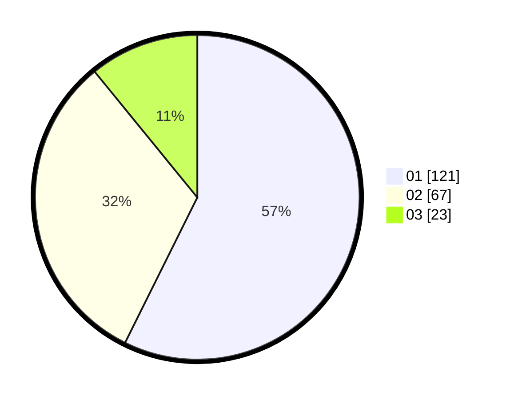

# Hasil

Hasil perolehan suara paslon dapat dilihat pada file paslon-01.txt, paslon-02.txt, dan paslon-03.txt.

Jika tidak ada, artinya data tersebut belum ada pada SIREKAP.

## Perolehan Suara

 * Paslon 01: **121**.
 * Paslon 02: **67**.
 * Paslon 03: **23**.

## Foto C Plano

https://sirekap-obj-formc.kpu.go.id/d962/pemilu/ppwp/31/74/08/10/02/3174081002143-20240215-024305--71936836-92f1-4cdf-a9a4-f0e13488cada.jpg

https://sirekap-obj-formc.kpu.go.id/d962/pemilu/ppwp/31/74/08/10/02/3174081002143-20240215-024620--da1c1ddd-8437-4d65-bde0-eeecfc8cca62.jpg

https://sirekap-obj-formc.kpu.go.id/d962/pemilu/ppwp/31/74/08/10/02/3174081002143-20240215-025628--b77ca715-bf84-4834-ba4e-6d3be2c8a4ff.jpg

## DATA PEMILIH TETAP

Jumlah pemilih dalam DPT: **260**.
 * L: **121**.
 * P: **139**.

## DATA PENGGUNA HAK PILIH

Jumlah pengguna hak pilih dalam DPT: **214**.
 * L: **98**.
 * P: **116**.

Jumlah pengguna hak pilih dalam DPTb: **0**.
 * L: **800**.
 * P: **0**.

Jumlah pengguna hak pilih dalam DPK: **0**.
 * L: **0**.
 * P: **0**.

Jumlah pengguna hak pilih: **214**.
 * L: **98**.
 * P: **116**.

## JUMLAH SUARA SAH DAN TIDAK SAH

JUMLAH SELURUH SUARA SAH: **211**.

JUMLAH SUARA TIDAK SAH: **3**.

JUMLAH SELURUH SUARA SAH DAN SUARA TIDAK SAH: **214**.
