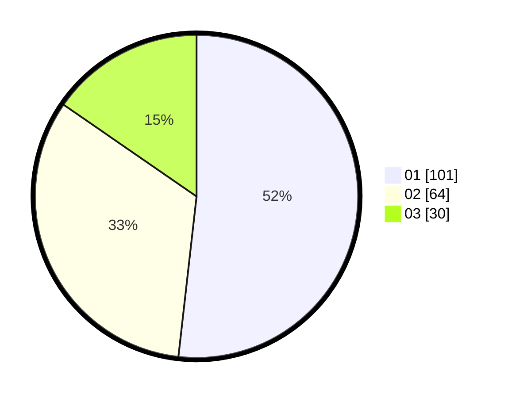

# Hasil

Hasil perolehan suara paslon dapat dilihat pada file paslon-01.txt, paslon-02.txt, dan paslon-03.txt.

Jika tidak ada, artinya data tersebut belum ada pada SIREKAP.

## Perolehan Suara

 * Paslon 01: **101**.
 * Paslon 02: **64**.
 * Paslon 03: **30**.

## Foto C Plano

https://sirekap-obj-formc.kpu.go.id/9981/pemilu/ppwp/31/74/08/10/02/3174081002144-20240215-113139--b23cdcf2-74e6-4572-a28f-fc07bababaf9.jpg

https://sirekap-obj-formc.kpu.go.id/9981/pemilu/ppwp/31/74/08/10/02/3174081002144-20240214-223127--cf67e573-681c-4405-8df4-c9617b65a7e2.jpg

https://sirekap-obj-formc.kpu.go.id/9981/pemilu/ppwp/31/74/08/10/02/3174081002144-20240214-223134--4aab79de-a6bc-420f-9a1d-e13452c2c87e.jpg

## DATA PEMILIH TETAP

Jumlah pemilih dalam DPT: **275**.
 * L: **128**.
 * P: **147**.

## DATA PENGGUNA HAK PILIH

Jumlah pengguna hak pilih dalam DPT: **197**.
 * L: **90**.
 * P: **107**.

Jumlah pengguna hak pilih dalam DPTb: **0**.
 * L: **0**.
 * P: **0**.

Jumlah pengguna hak pilih dalam DPK: **0**.
 * L: **0**.
 * P: **0**.

Jumlah pengguna hak pilih: **197**.
 * L: **90**.
 * P: **107**.

## JUMLAH SUARA SAH DAN TIDAK SAH

JUMLAH SELURUH SUARA SAH: **195**.

JUMLAH SUARA TIDAK SAH: **2**.

JUMLAH SELURUH SUARA SAH DAN SUARA TIDAK SAH: **197**.
