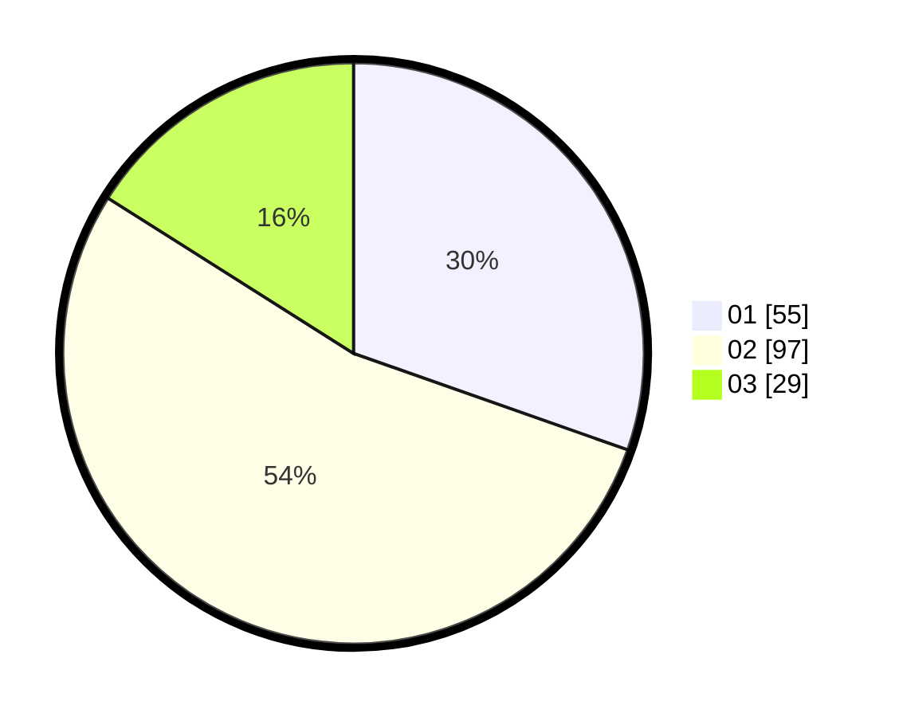

# Hasil

Hasil perolehan suara paslon dapat dilihat pada file paslon-01.txt, paslon-02.txt, dan paslon-03.txt.

Jika tidak ada, artinya data tersebut belum ada pada SIREKAP.

## Perolehan Suara

 * Paslon 01: **55**.
 * Paslon 02: **97**.
 * Paslon 03: **29**.

## Foto C Plano

https://sirekap-obj-formc.kpu.go.id/6070/pemilu/ppwp/31/74/08/10/03/3174081003023-20240218-181416--84dfb2c9-bf39-4c7d-9045-790a12c55b2e.jpg

https://sirekap-obj-formc.kpu.go.id/6070/pemilu/ppwp/31/74/08/10/03/3174081003023-20240218-181417--ad697e35-0fcf-4ec1-95a6-0c77486f76b9.jpg

https://sirekap-obj-formc.kpu.go.id/6070/pemilu/ppwp/31/74/08/10/03/3174081003023-20240218-181416--5e99d57e-d192-4a5a-b573-cc6fa2a382e6.jpg

## DATA PEMILIH TETAP

Jumlah pemilih dalam DPT: **219**.
 * L: **97**.
 * P: **122**.

## DATA PENGGUNA HAK PILIH

Jumlah pengguna hak pilih dalam DPT: **168**.
 * L: **74**.
 * P: **94**.

Jumlah pengguna hak pilih dalam DPTb: **15**.
 * L: **6**.
 * P: **9**.

Jumlah pengguna hak pilih dalam DPK: **2**.
 * L: **1**.
 * P: **1**.

Jumlah pengguna hak pilih: **185**.
 * L: **81**.
 * P: **104**.

## JUMLAH SUARA SAH DAN TIDAK SAH

JUMLAH SELURUH SUARA SAH: **181**.

JUMLAH SUARA TIDAK SAH: **4**.

JUMLAH SELURUH SUARA SAH DAN SUARA TIDAK SAH: **185**.
