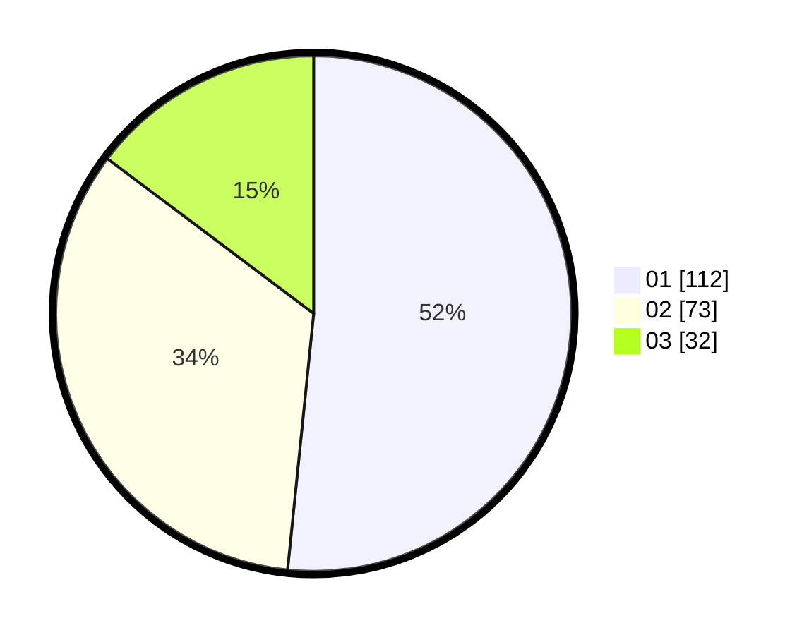

# Hasil

Hasil perolehan suara paslon dapat dilihat pada file paslon-01.txt, paslon-02.txt, dan paslon-03.txt.

Jika tidak ada, artinya data tersebut belum ada pada SIREKAP.

## Perolehan Suara

 * Paslon 01: **112**.
 * Paslon 02: **73**.
 * Paslon 03: **32**.

## Foto C Plano

https://sirekap-obj-formc.kpu.go.id/9494/pemilu/ppwp/31/74/08/10/03/3174081003028-20240217-202009--31efa4aa-f68b-4578-95c3-c0dc1bc46162.jpg

https://sirekap-obj-formc.kpu.go.id/9494/pemilu/ppwp/31/74/08/10/03/3174081003028-20240217-202010--f9192a31-c95b-4a23-9d3e-6e39306ed91f.jpg

https://sirekap-obj-formc.kpu.go.id/9494/pemilu/ppwp/31/74/08/10/03/3174081003028-20240217-202010--aaf156dc-ea65-4d9b-bcf9-728c1b120360.jpg

## DATA PEMILIH TETAP

Jumlah pemilih dalam DPT: **252**.
 * L: **121**.
 * P: **131**.

## DATA PENGGUNA HAK PILIH

Jumlah pengguna hak pilih dalam DPT: **199**.
 * L: **93**.
 * P: **106**.

Jumlah pengguna hak pilih dalam DPTb: **23**.
 * L: **8**.
 * P: **15**.

Jumlah pengguna hak pilih dalam DPK: **0**.
 * L: **0**.
 * P: **0**.

Jumlah pengguna hak pilih: **222**.
 * L: **101**.
 * P: **121**.

## JUMLAH SUARA SAH DAN TIDAK SAH

JUMLAH SELURUH SUARA SAH: **217**.

JUMLAH SUARA TIDAK SAH: **5**.

JUMLAH SELURUH SUARA SAH DAN SUARA TIDAK SAH: **222**.
