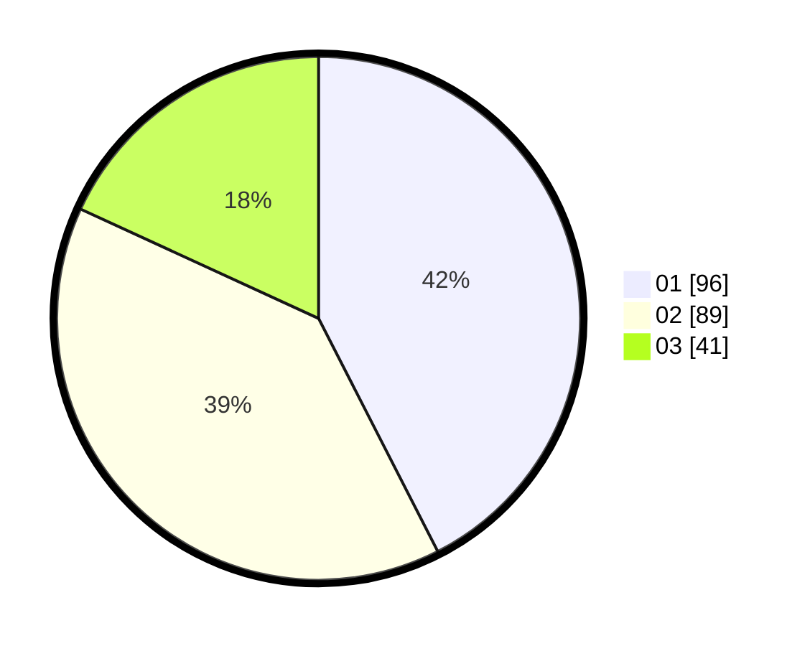

# Hasil

Hasil perolehan suara paslon dapat dilihat pada file paslon-01.txt, paslon-02.txt, dan paslon-03.txt.

Jika tidak ada, artinya data tersebut belum ada pada SIREKAP.

## Perolehan Suara

 * Paslon 01: **96**.
 * Paslon 02: **89**.
 * Paslon 03: **41**.

## Foto C Plano

https://sirekap-obj-formc.kpu.go.id/3cd0/pemilu/ppwp/31/74/08/10/03/3174081003036-20240214-204218--9b4886f8-3547-4988-a107-6fccdba83b17.jpg

https://sirekap-obj-formc.kpu.go.id/3cd0/pemilu/ppwp/31/74/08/10/03/3174081003036-20240214-204400--db168cff-1914-4dd5-9ba3-2510c071e6d3.jpg

https://sirekap-obj-formc.kpu.go.id/3cd0/pemilu/ppwp/31/74/08/10/03/3174081003036-20240214-190304--5e16e4ad-6fd8-4299-b62b-12ee473169a7.jpg
