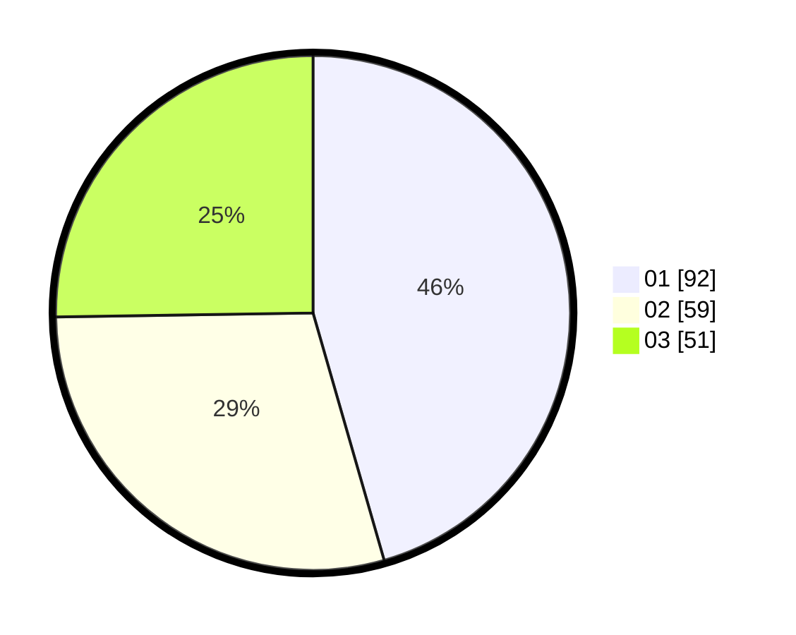

# Hasil

Hasil perolehan suara paslon dapat dilihat pada file paslon-01.txt, paslon-02.txt, dan paslon-03.txt.

Jika tidak ada, artinya data tersebut belum ada pada SIREKAP.

## Perolehan Suara

 * Paslon 01: **92**.
 * Paslon 02: **59**.
 * Paslon 03: **51**.

## Foto C Plano

https://sirekap-obj-formc.kpu.go.id/08ed/pemilu/ppwp/31/74/08/10/03/3174081003049-20240214-155531--0fa8ee41-61ea-47f3-885f-e0098759a876.jpg

https://sirekap-obj-formc.kpu.go.id/08ed/pemilu/ppwp/31/74/08/10/03/3174081003049-20240214-155344--c2289c37-fc19-4b4f-b5ff-84238f75a19b.jpg

https://sirekap-obj-formc.kpu.go.id/08ed/pemilu/ppwp/31/74/08/10/03/3174081003049-20240214-155920--53d39bf1-b6ba-4c68-b5b6-0a2db893eae7.jpg

## DATA PEMILIH TETAP

Jumlah pemilih dalam DPT: **244**.
 * L: **117**.
 * P: **127**.

## DATA PENGGUNA HAK PILIH

Jumlah pengguna hak pilih dalam DPT: **189**.
 * L: **89**.
 * P: **100**.

Jumlah pengguna hak pilih dalam DPTb: **9**.
 * L: **5**.
 * P: **4**.

Jumlah pengguna hak pilih dalam DPK: **5**.
 * L: **2**.
 * P: **3**.

Jumlah pengguna hak pilih: **203**.
 * L: **96**.
 * P: **107**.

## JUMLAH SUARA SAH DAN TIDAK SAH

JUMLAH SELURUH SUARA SAH: **202**.

JUMLAH SUARA TIDAK SAH: **1**.

JUMLAH SELURUH SUARA SAH DAN SUARA TIDAK SAH: **203**.
