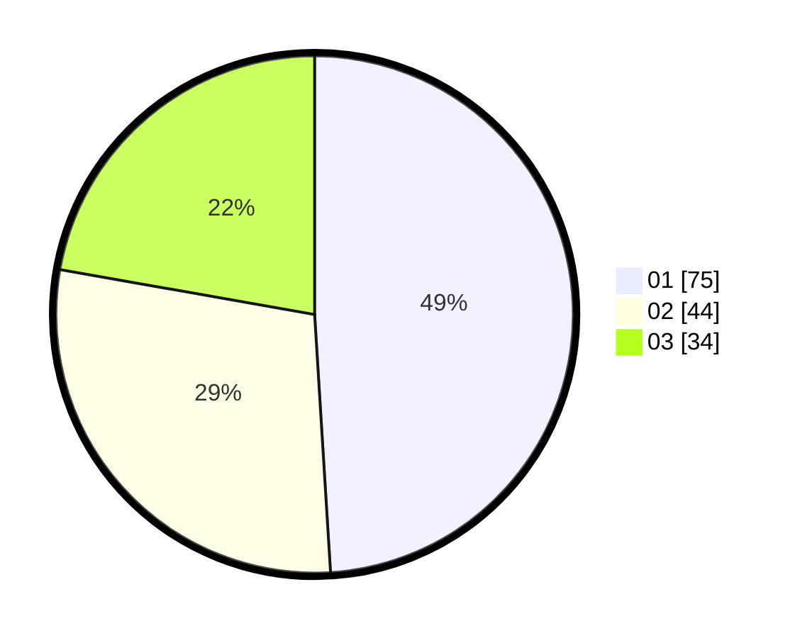

# Hasil

Hasil perolehan suara paslon dapat dilihat pada file paslon-01.txt, paslon-02.txt, dan paslon-03.txt.

Jika tidak ada, artinya data tersebut belum ada pada SIREKAP.

## Perolehan Suara

 * Paslon 01: **75**.
 * Paslon 02: **44**.
 * Paslon 03: **34**.

## Foto C Plano

https://sirekap-obj-formc.kpu.go.id/4621/pemilu/ppwp/31/74/08/10/04/3174081004004-20240215-001853--53063069-18a7-48ad-a177-f70c0fa434d3.jpg

https://sirekap-obj-formc.kpu.go.id/4621/pemilu/ppwp/31/74/08/10/04/3174081004004-20240215-002011--62dbf491-4ea2-4090-9180-b458e971e5b1.jpg

https://sirekap-obj-formc.kpu.go.id/4621/pemilu/ppwp/31/74/08/10/04/3174081004004-20240215-002328--b33d6711-e1a1-49d7-bf96-b69b320dd4d9.jpg
