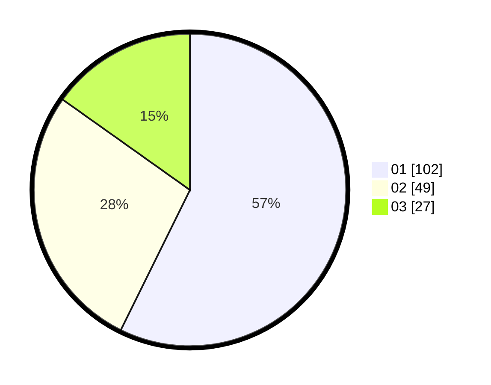

# Hasil

Hasil perolehan suara paslon dapat dilihat pada file paslon-01.txt, paslon-02.txt, dan paslon-03.txt.

Jika tidak ada, artinya data tersebut belum ada pada SIREKAP.

## Perolehan Suara

 * Paslon 01: **102**.
 * Paslon 02: **49**.
 * Paslon 03: **27**.

## Foto C Plano

https://sirekap-obj-formc.kpu.go.id/c023/pemilu/ppwp/31/74/08/10/04/3174081004005-20240218-121730--e5f04d01-8d6b-4343-a4ed-0d194e8c87b6.jpg

https://sirekap-obj-formc.kpu.go.id/c023/pemilu/ppwp/31/74/08/10/04/3174081004005-20240218-121937--6ab8f6b1-1db2-4e74-8584-c3f1e167fc50.jpg

https://sirekap-obj-formc.kpu.go.id/c023/pemilu/ppwp/31/74/08/10/04/3174081004005-20240218-122054--0fbfc8f2-b312-40da-a1ef-ddec95536c57.jpg

## DATA PEMILIH TETAP

Jumlah pemilih dalam DPT: **220**.
 * L: **107**.
 * P: **113**.

## DATA PENGGUNA HAK PILIH

Jumlah pengguna hak pilih dalam DPT: **174**.
 * L: **80**.
 * P: **94**.

Jumlah pengguna hak pilih dalam DPTb: **5**.
 * L: **3**.
 * P: **2**.

Jumlah pengguna hak pilih dalam DPK: **3**.
 * L: **2**.
 * P: **1**.

Jumlah pengguna hak pilih: **182**.
 * L: **85**.
 * P: **97**.

## JUMLAH SUARA SAH DAN TIDAK SAH

JUMLAH SELURUH SUARA SAH: **178**.

JUMLAH SUARA TIDAK SAH: **4**.

JUMLAH SELURUH SUARA SAH DAN SUARA TIDAK SAH: **182**.
