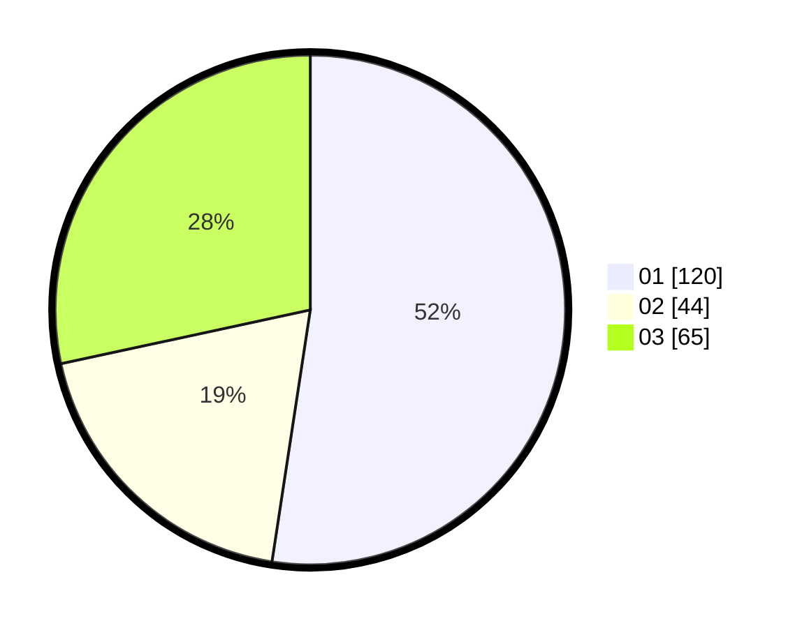

# Hasil

Hasil perolehan suara paslon dapat dilihat pada file paslon-01.txt, paslon-02.txt, dan paslon-03.txt.

Jika tidak ada, artinya data tersebut belum ada pada SIREKAP.

## Perolehan Suara

 * Paslon 01: **120**.
 * Paslon 02: **44**.
 * Paslon 03: **65**.

## Foto C Plano

https://sirekap-obj-formc.kpu.go.id/ee52/pemilu/ppwp/31/74/08/10/04/3174081004012-20240219-141331--0753f428-cd72-4497-96fc-674591753226.jpg

https://sirekap-obj-formc.kpu.go.id/ee52/pemilu/ppwp/31/74/08/10/04/3174081004012-20240219-141509--b9f8f190-8d3c-4776-b004-6236e27be514.jpg

https://sirekap-obj-formc.kpu.go.id/ee52/pemilu/ppwp/31/74/08/10/04/3174081004012-20240219-141551--8a28a079-602e-4e27-a8c6-4215cb6d3cd0.jpg

## DATA PEMILIH TETAP

Jumlah pemilih dalam DPT: **267**.
 * L: **122**.
 * P: **145**.

## DATA PENGGUNA HAK PILIH

Jumlah pengguna hak pilih dalam DPT: **231**.
 * L: **103**.
 * P: **128**.

Jumlah pengguna hak pilih dalam DPTb: **7**.
 * L: **3**.
 * P: **4**.

Jumlah pengguna hak pilih dalam DPK: **3**.
 * L: **1**.
 * P: **2**.

Jumlah pengguna hak pilih: **241**.
 * L: **107**.
 * P: **134**.

## JUMLAH SUARA SAH DAN TIDAK SAH

JUMLAH SELURUH SUARA SAH: **239**.

JUMLAH SUARA TIDAK SAH: **2**.

JUMLAH SELURUH SUARA SAH DAN SUARA TIDAK SAH: **241**.
