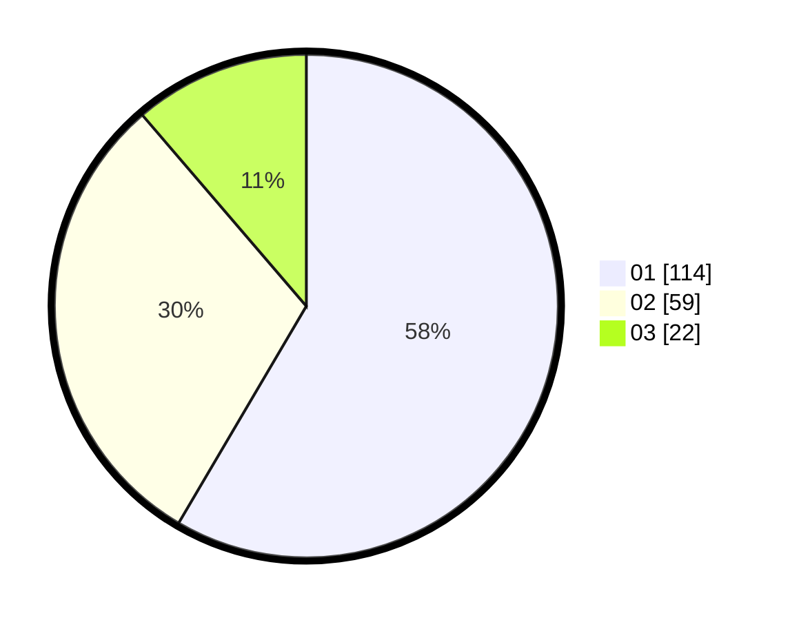

# Hasil

Hasil perolehan suara paslon dapat dilihat pada file paslon-01.txt, paslon-02.txt, dan paslon-03.txt.

Jika tidak ada, artinya data tersebut belum ada pada SIREKAP.

## Perolehan Suara

 * Paslon 01: **114**.
 * Paslon 02: **59**.
 * Paslon 03: **22**.

## Foto C Plano

https://sirekap-obj-formc.kpu.go.id/d8a1/pemilu/ppwp/31/74/08/10/04/3174081004014-20240214-203622--d48ef46d-6b86-4970-96ca-d98444b1d26e.jpg

https://sirekap-obj-formc.kpu.go.id/d8a1/pemilu/ppwp/31/74/08/10/04/3174081004014-20240214-203712--91ccbc9b-a867-462c-b56a-a03a6958aaa1.jpg

https://sirekap-obj-formc.kpu.go.id/d8a1/pemilu/ppwp/31/74/08/10/04/3174081004014-20240214-203747--730a4e6a-1f7b-42ef-a7ed-e46cb62b7637.jpg

## DATA PEMILIH TETAP

Jumlah pemilih dalam DPT: **233**.
 * L: **119**.
 * P: **114**.

## DATA PENGGUNA HAK PILIH

Jumlah pengguna hak pilih dalam DPT: **198**.
 * L: **99**.
 * P: **99**.

Jumlah pengguna hak pilih dalam DPTb: **4**.
 * L: **4**.
 * P: **0**.

Jumlah pengguna hak pilih dalam DPK: **0**.
 * L: **0**.
 * P: **0**.

Jumlah pengguna hak pilih: **202**.
 * L: **103**.
 * P: **99**.

## JUMLAH SUARA SAH DAN TIDAK SAH

JUMLAH SELURUH SUARA SAH: **195**.

JUMLAH SUARA TIDAK SAH: **7**.

JUMLAH SELURUH SUARA SAH DAN SUARA TIDAK SAH: **202**.
