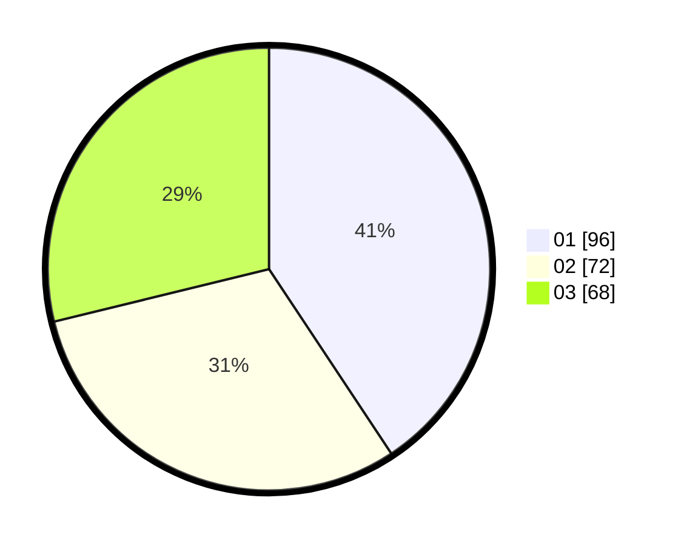

# Hasil

Hasil perolehan suara paslon dapat dilihat pada file paslon-01.txt, paslon-02.txt, dan paslon-03.txt.

Jika tidak ada, artinya data tersebut belum ada pada SIREKAP.

## Perolehan Suara

 * Paslon 01: **96**.
 * Paslon 02: **72**.
 * Paslon 03: **68**.

## Foto C Plano

https://sirekap-obj-formc.kpu.go.id/e8db/pemilu/ppwp/31/74/08/10/04/3174081004032-20240214-184622--411dd2a2-00f3-4f80-8bcd-49befe28d07b.jpg

https://sirekap-obj-formc.kpu.go.id/e8db/pemilu/ppwp/31/74/08/10/04/3174081004032-20240214-184957--3f7e3a45-f7e1-415c-9fa2-6bd6e9c63bff.jpg

https://sirekap-obj-formc.kpu.go.id/e8db/pemilu/ppwp/31/74/08/10/04/3174081004032-20240214-231637--4af858a5-a725-4fc1-89bc-1e09cc3cce3e.jpg

## DATA PEMILIH TETAP

Jumlah pemilih dalam DPT: **282**.
 * L: **139**.
 * P: **143**.

## DATA PENGGUNA HAK PILIH

Jumlah pengguna hak pilih dalam DPT: **227**.
 * L: **109**.
 * P: **118**.

Jumlah pengguna hak pilih dalam DPTb: **9**.
 * L: **4**.
 * P: **5**.

Jumlah pengguna hak pilih dalam DPK: **0**.
 * L: **0**.
 * P: **0**.

Jumlah pengguna hak pilih: **236**.
 * L: **113**.
 * P: **123**.

## JUMLAH SUARA SAH DAN TIDAK SAH

JUMLAH SELURUH SUARA SAH: **236**.

JUMLAH SUARA TIDAK SAH: **0**.

JUMLAH SELURUH SUARA SAH DAN SUARA TIDAK SAH: **236**.
