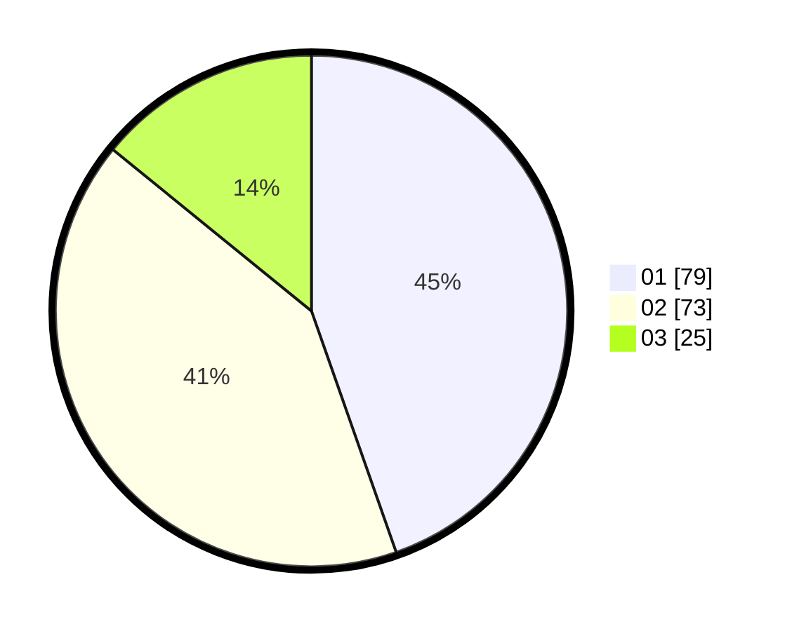

# Hasil

Hasil perolehan suara paslon dapat dilihat pada file paslon-01.txt, paslon-02.txt, dan paslon-03.txt.

Jika tidak ada, artinya data tersebut belum ada pada SIREKAP.

## Perolehan Suara

 * Paslon 01: **79**.
 * Paslon 02: **73**.
 * Paslon 03: **25**.

## Foto C Plano

https://sirekap-obj-formc.kpu.go.id/a283/pemilu/ppwp/31/74/08/10/04/3174081004043-20240214-201905--04e78e9e-a9cb-473e-b60d-f5f51e385cd4.jpg

https://sirekap-obj-formc.kpu.go.id/a283/pemilu/ppwp/31/74/08/10/04/3174081004043-20240214-202152--24e5d579-5673-4a6e-9fc4-0183b1ee0edb.jpg

https://sirekap-obj-formc.kpu.go.id/a283/pemilu/ppwp/31/74/08/10/04/3174081004043-20240214-202431--ff8be3d7-0582-4f72-8f32-a95e013684d5.jpg

## DATA PEMILIH TETAP

Jumlah pemilih dalam DPT: **246**.
 * L: **123**.
 * P: **123**.

## DATA PENGGUNA HAK PILIH

Jumlah pengguna hak pilih dalam DPT: **179**.
 * L: **87**.
 * P: **92**.

Jumlah pengguna hak pilih dalam DPTb: **2**.
 * L: **1**.
 * P: **1**.

Jumlah pengguna hak pilih dalam DPK: **2**.
 * L: **1**.
 * P: **1**.

Jumlah pengguna hak pilih: **183**.
 * L: **89**.
 * P: **94**.

## JUMLAH SUARA SAH DAN TIDAK SAH

JUMLAH SELURUH SUARA SAH: **177**.

JUMLAH SUARA TIDAK SAH: **2**.

JUMLAH SELURUH SUARA SAH DAN SUARA TIDAK SAH: **179**.
