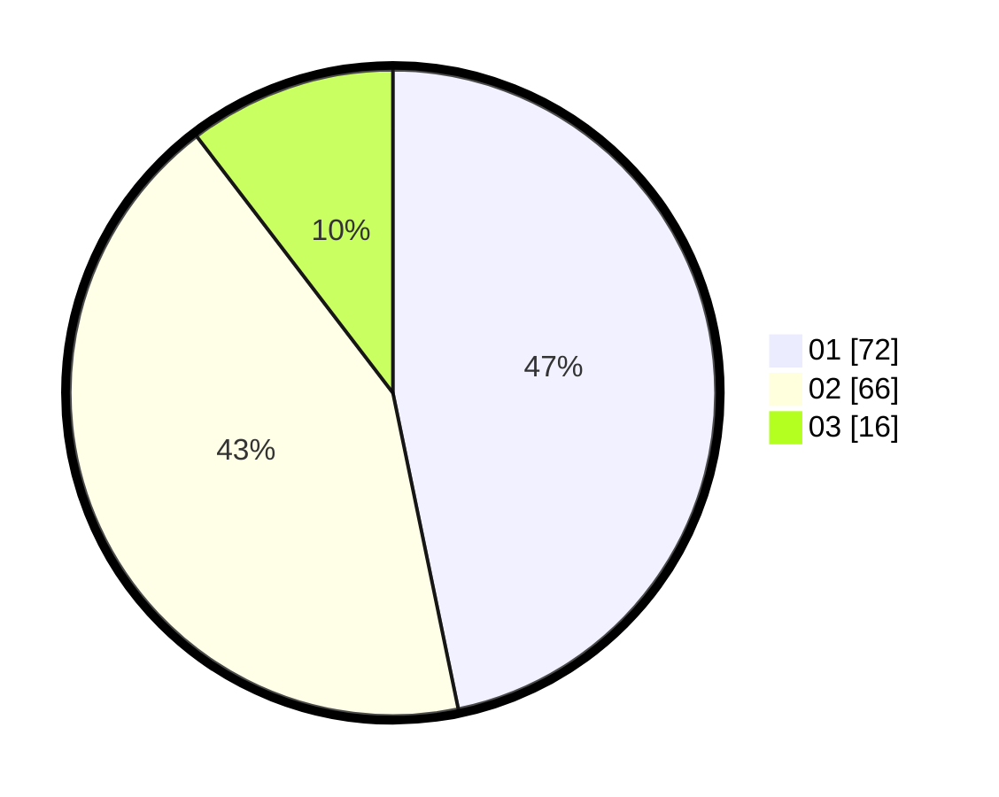

# Hasil

Hasil perolehan suara paslon dapat dilihat pada file paslon-01.txt, paslon-02.txt, dan paslon-03.txt.

Jika tidak ada, artinya data tersebut belum ada pada SIREKAP.

## Perolehan Suara

 * Paslon 01: **72**.
 * Paslon 02: **66**.
 * Paslon 03: **16**.

## Foto C Plano

https://sirekap-obj-formc.kpu.go.id/e521/pemilu/ppwp/31/74/08/10/04/3174081004053-20240214-200912--61b2e5ac-d2c8-47e6-a05c-ab7a8cc56d9f.jpg

https://sirekap-obj-formc.kpu.go.id/e521/pemilu/ppwp/31/74/08/10/04/3174081004053-20240214-201045--96841617-466c-447d-a4af-92669778ea7c.jpg

https://sirekap-obj-formc.kpu.go.id/e521/pemilu/ppwp/31/74/08/10/04/3174081004053-20240214-201243--ca43cda7-7759-49ac-9691-e31a4a99dcd7.jpg

## DATA PEMILIH TETAP

Jumlah pemilih dalam DPT: **218**.
 * L: **101**.
 * P: **117**.

## DATA PENGGUNA HAK PILIH

Jumlah pengguna hak pilih dalam DPT: **156**.
 * L: **70**.
 * P: **86**.

Jumlah pengguna hak pilih dalam DPTb: **0**.
 * L: **0**.
 * P: **0**.

Jumlah pengguna hak pilih dalam DPK: **1**.
 * L: **1**.
 * P: **0**.

Jumlah pengguna hak pilih: **157**.
 * L: **71**.
 * P: **86**.

## JUMLAH SUARA SAH DAN TIDAK SAH

JUMLAH SELURUH SUARA SAH: **154**.

JUMLAH SUARA TIDAK SAH: **3**.

JUMLAH SELURUH SUARA SAH DAN SUARA TIDAK SAH: **157**.
