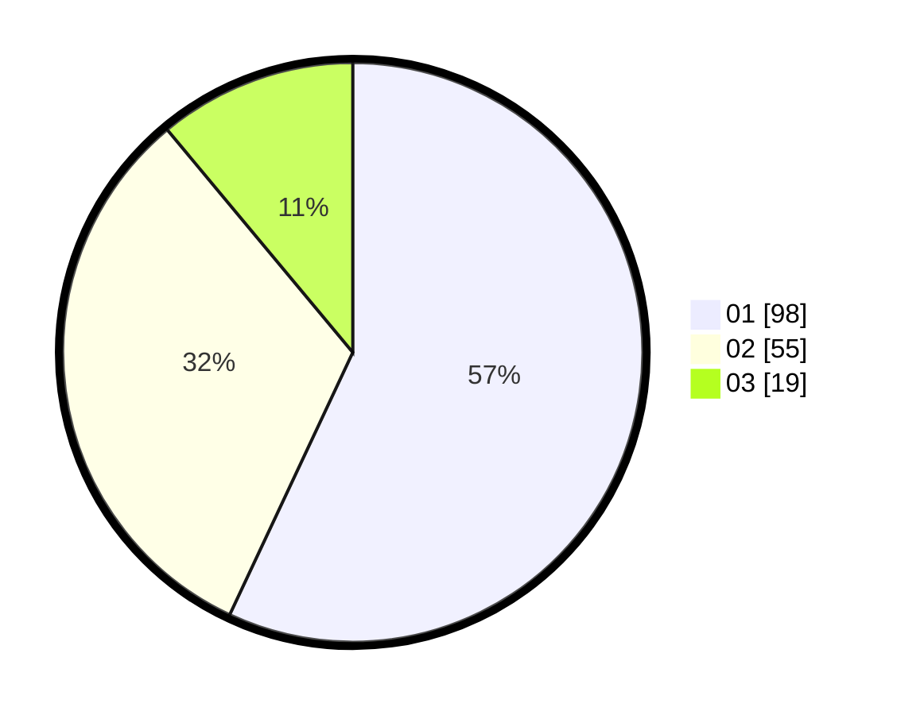

# Hasil

Hasil perolehan suara paslon dapat dilihat pada file paslon-01.txt, paslon-02.txt, dan paslon-03.txt.

Jika tidak ada, artinya data tersebut belum ada pada SIREKAP.

## Perolehan Suara

 * Paslon 01: **98**.
 * Paslon 02: **55**.
 * Paslon 03: **19**.

## Foto C Plano

https://sirekap-obj-formc.kpu.go.id/6ada/pemilu/ppwp/31/74/08/10/04/3174081004054-20240214-185135--9afc05bb-9829-4894-a2d0-56ef4f39feba.jpg

https://sirekap-obj-formc.kpu.go.id/6ada/pemilu/ppwp/31/74/08/10/04/3174081004054-20240214-193426--deb6fac5-1f65-42f0-88b9-6161e3d50507.jpg

https://sirekap-obj-formc.kpu.go.id/6ada/pemilu/ppwp/31/74/08/10/04/3174081004054-20240214-185133--81420692-8796-420c-a39b-aa4a0abd5f1c.jpg

## DATA PEMILIH TETAP

Jumlah pemilih dalam DPT: **219**.
 * L: **116**.
 * P: **103**.

## DATA PENGGUNA HAK PILIH

Jumlah pengguna hak pilih dalam DPT: **170**.
 * L: **87**.
 * P: **83**.

Jumlah pengguna hak pilih dalam DPTb: **5**.
 * L: **3**.
 * P: **2**.

Jumlah pengguna hak pilih dalam DPK: **1**.
 * L: **0**.
 * P: **1**.

Jumlah pengguna hak pilih: **176**.
 * L: **90**.
 * P: **86**.

## JUMLAH SUARA SAH DAN TIDAK SAH

JUMLAH SELURUH SUARA SAH: **172**.

JUMLAH SUARA TIDAK SAH: **4**.

JUMLAH SELURUH SUARA SAH DAN SUARA TIDAK SAH: **176**.
