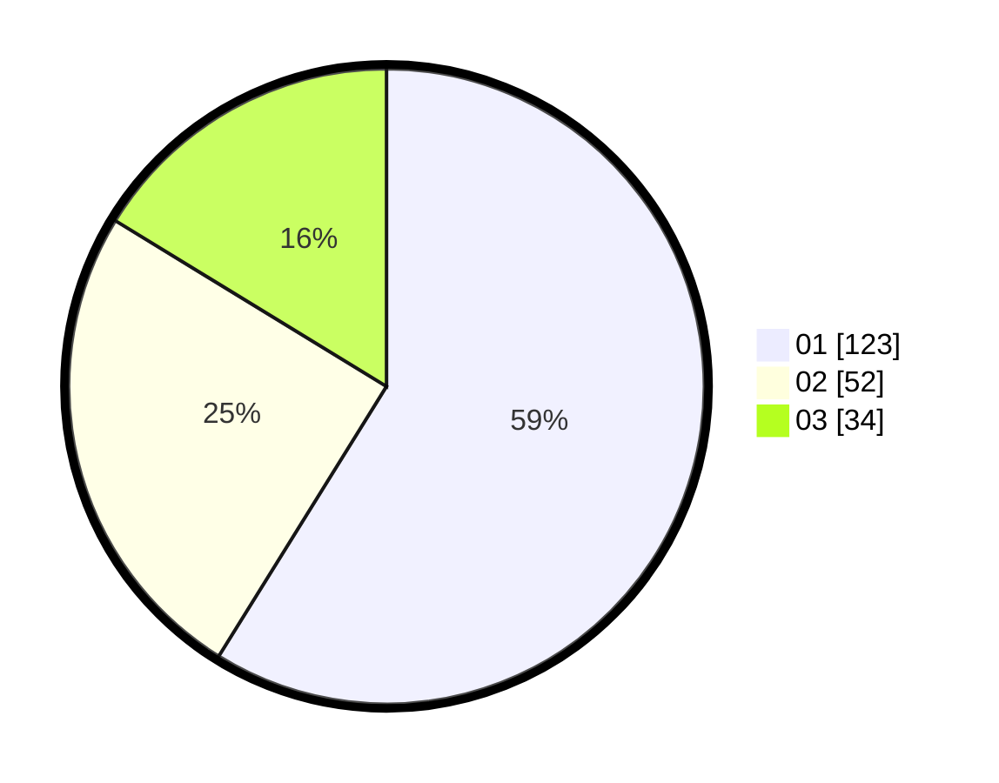

# Hasil

Hasil perolehan suara paslon dapat dilihat pada file paslon-01.txt, paslon-02.txt, dan paslon-03.txt.

Jika tidak ada, artinya data tersebut belum ada pada SIREKAP.

## Perolehan Suara

 * Paslon 01: **123**.
 * Paslon 02: **52**.
 * Paslon 03: **34**.

## Foto C Plano

https://sirekap-obj-formc.kpu.go.id/d9b5/pemilu/ppwp/31/74/08/10/04/3174081004067-20240216-145657--903b0d6c-cb7f-4d51-b35b-e2e7823cef47.jpg

https://sirekap-obj-formc.kpu.go.id/d9b5/pemilu/ppwp/31/74/08/10/04/3174081004067-20240214-155755--947c2f62-14b1-4bfb-b29c-30adcc62b2ad.jpg

https://sirekap-obj-formc.kpu.go.id/d9b5/pemilu/ppwp/31/74/08/10/04/3174081004067-20240214-160058--22ad84c3-e752-4167-badf-477efc0e34b4.jpg

## DATA PEMILIH TETAP

Jumlah pemilih dalam DPT: **273**.
 * L: **128**.
 * P: **145**.

## DATA PENGGUNA HAK PILIH

Jumlah pengguna hak pilih dalam DPT: **207**.
 * L: **84**.
 * P: **123**.

Jumlah pengguna hak pilih dalam DPTb: **0**.
 * L: **0**.
 * P: **0**.

Jumlah pengguna hak pilih dalam DPK: **3**.
 * L: **2**.
 * P: **1**.

Jumlah pengguna hak pilih: **210**.
 * L: **86**.
 * P: **124**.

## JUMLAH SUARA SAH DAN TIDAK SAH

JUMLAH SELURUH SUARA SAH: **209**.

JUMLAH SUARA TIDAK SAH: **1**.

JUMLAH SELURUH SUARA SAH DAN SUARA TIDAK SAH: **210**.
