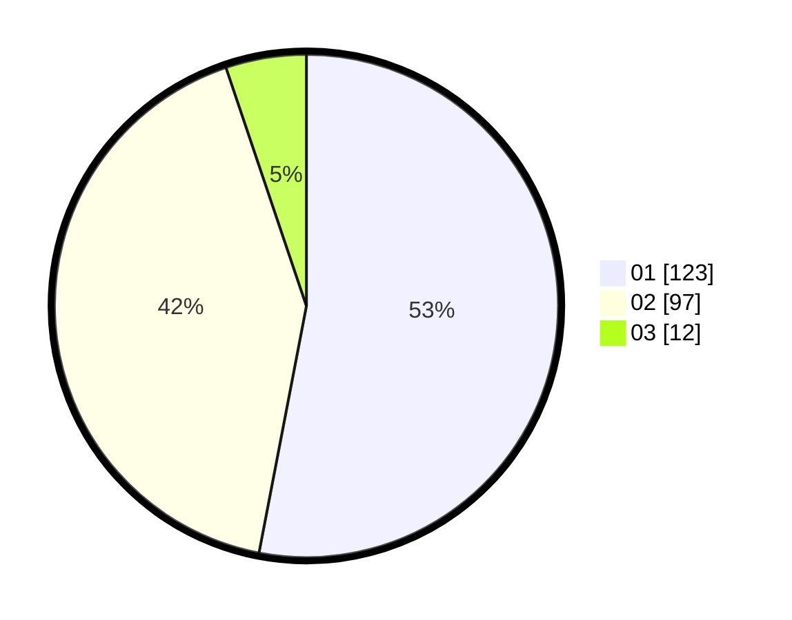

# Hasil

Hasil perolehan suara paslon dapat dilihat pada file paslon-01.txt, paslon-02.txt, dan paslon-03.txt.

Jika tidak ada, artinya data tersebut belum ada pada SIREKAP.

## Perolehan Suara

 * Paslon 01: **123**.
 * Paslon 02: **97**.
 * Paslon 03: **12**.

## Foto C Plano

https://sirekap-obj-formc.kpu.go.id/8340/pemilu/ppwp/31/74/08/10/04/3174081004083-20240214-194928--5eae6bb4-2eb9-48be-867f-9123f7e4d65a.jpg

https://sirekap-obj-formc.kpu.go.id/8340/pemilu/ppwp/31/74/08/10/04/3174081004083-20240214-194916--e5d22303-e503-442f-88f9-d1142578f00b.jpg

https://sirekap-obj-formc.kpu.go.id/8340/pemilu/ppwp/31/74/08/10/04/3174081004083-20240214-195324--82e39242-1cd6-4826-ab36-aec463a31fae.jpg
