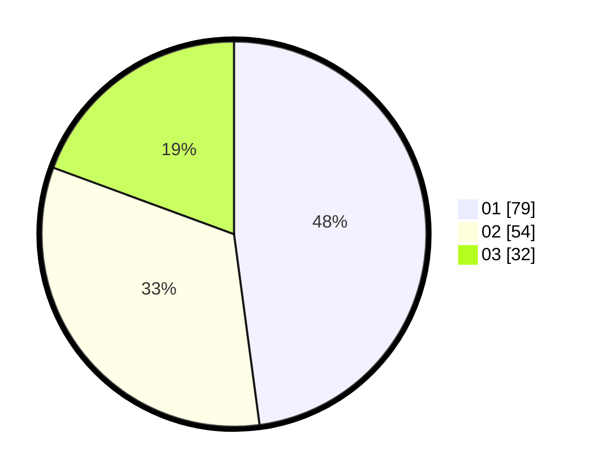

# Hasil

Hasil perolehan suara paslon dapat dilihat pada file paslon-01.txt, paslon-02.txt, dan paslon-03.txt.

Jika tidak ada, artinya data tersebut belum ada pada SIREKAP.

## Perolehan Suara

 * Paslon 01: **79**.
 * Paslon 02: **54**.
 * Paslon 03: **32**.

## Foto C Plano

https://sirekap-obj-formc.kpu.go.id/ed4e/pemilu/ppwp/31/74/08/10/04/3174081004091-20240216-002100--28314c91-22a2-450f-a446-9148294d50fe.jpg

https://sirekap-obj-formc.kpu.go.id/ed4e/pemilu/ppwp/31/74/08/10/04/3174081004091-20240216-002102--2b6783b0-9d04-46b0-9db1-c1dfa04fc218.jpg

https://sirekap-obj-formc.kpu.go.id/ed4e/pemilu/ppwp/31/74/08/10/04/3174081004091-20240216-002101--03291d13-373b-4c5c-a36e-c6b6c860528f.jpg

## DATA PEMILIH TETAP

Jumlah pemilih dalam DPT: **220**.
 * L: **115**.
 * P: **105**.

## DATA PENGGUNA HAK PILIH

Jumlah pengguna hak pilih dalam DPT: **168**.
 * L: **83**.
 * P: **85**.

Jumlah pengguna hak pilih dalam DPTb: **1**.
 * L: **1**.
 * P: **0**.

Jumlah pengguna hak pilih dalam DPK: **1**.
 * L: **0**.
 * P: **1**.

Jumlah pengguna hak pilih: **170**.
 * L: **84**.
 * P: **86**.

## JUMLAH SUARA SAH DAN TIDAK SAH

JUMLAH SELURUH SUARA SAH: **165**.

JUMLAH SUARA TIDAK SAH: **5**.

JUMLAH SELURUH SUARA SAH DAN SUARA TIDAK SAH: **170**.
