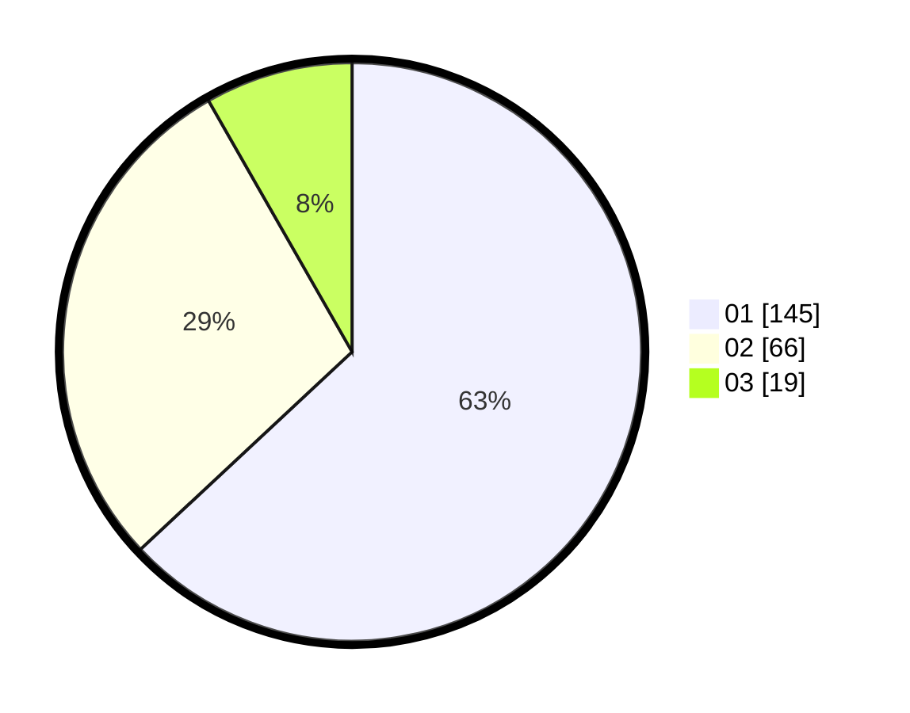

# Hasil

Hasil perolehan suara paslon dapat dilihat pada file paslon-01.txt, paslon-02.txt, dan paslon-03.txt.

Jika tidak ada, artinya data tersebut belum ada pada SIREKAP.

## Perolehan Suara

 * Paslon 01: **145**.
 * Paslon 02: **66**.
 * Paslon 03: **19**.

## Foto C Plano

https://sirekap-obj-formc.kpu.go.id/47d5/pemilu/ppwp/31/74/08/10/04/3174081004096-20240214-231814--4e9204d5-1df5-4bf3-8f82-0a042d4d8112.jpg

https://sirekap-obj-formc.kpu.go.id/47d5/pemilu/ppwp/31/74/08/10/04/3174081004096-20240214-231847--9e07f39b-320f-4488-b329-330968bcad91.jpg

https://sirekap-obj-formc.kpu.go.id/47d5/pemilu/ppwp/31/74/08/10/04/3174081004096-20240214-231922--d7a3adc2-e836-463a-933d-81cc6ebb129f.jpg

## DATA PEMILIH TETAP

Jumlah pemilih dalam DPT: **280**.
 * L: **140**.
 * P: **140**.

## DATA PENGGUNA HAK PILIH

Jumlah pengguna hak pilih dalam DPT: **226**.
 * L: **109**.
 * P: **117**.

Jumlah pengguna hak pilih dalam DPTb: **3**.
 * L: **2**.
 * P: **1**.

Jumlah pengguna hak pilih dalam DPK: **2**.
 * L: **0**.
 * P: **2**.

Jumlah pengguna hak pilih: **231**.
 * L: **111**.
 * P: **120**.

## JUMLAH SUARA SAH DAN TIDAK SAH

JUMLAH SELURUH SUARA SAH: **230**.

JUMLAH SUARA TIDAK SAH: **1**.

JUMLAH SELURUH SUARA SAH DAN SUARA TIDAK SAH: **231**.
