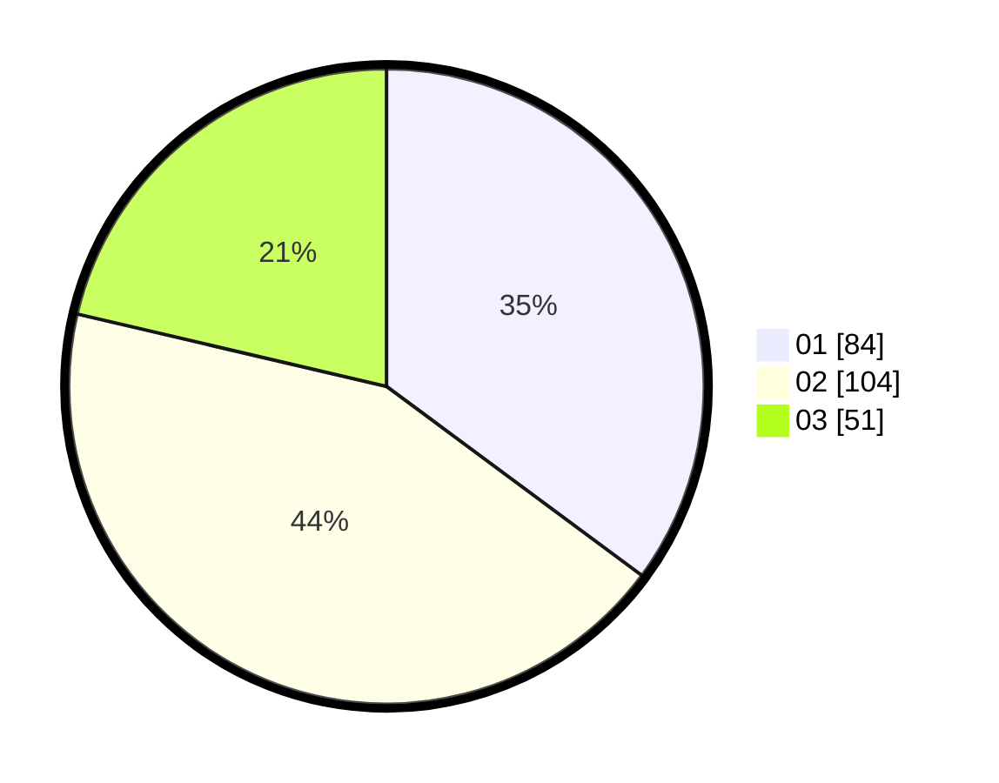

# Hasil

Hasil perolehan suara paslon dapat dilihat pada file paslon-01.txt, paslon-02.txt, dan paslon-03.txt.

Jika tidak ada, artinya data tersebut belum ada pada SIREKAP.

## Perolehan Suara

 * Paslon 01: **84**.
 * Paslon 02: **104**.
 * Paslon 03: **51**.

## Foto C Plano

https://sirekap-obj-formc.kpu.go.id/5fc0/pemilu/ppwp/31/74/08/10/04/3174081004103-20240214-212354--a3161934-ea65-4be7-bd30-e7810c5a9d84.jpg

https://sirekap-obj-formc.kpu.go.id/5fc0/pemilu/ppwp/31/74/08/10/04/3174081004103-20240214-190852--863a6f5b-1cab-421c-8e27-358eb320f218.jpg

https://sirekap-obj-formc.kpu.go.id/5fc0/pemilu/ppwp/31/74/08/10/04/3174081004103-20240214-193730--6b1c7514-9fac-4994-8852-aa103b3cd157.jpg
