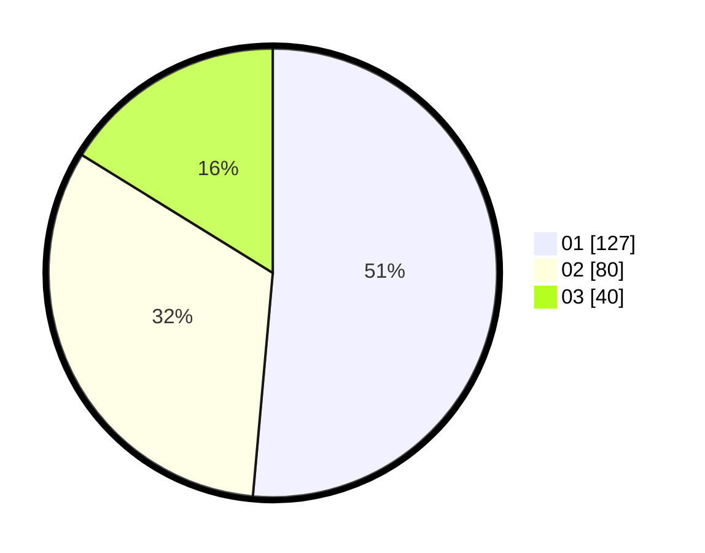

# Hasil

Hasil perolehan suara paslon dapat dilihat pada file paslon-01.txt, paslon-02.txt, dan paslon-03.txt.

Jika tidak ada, artinya data tersebut belum ada pada SIREKAP.

## Perolehan Suara

 * Paslon 01: **127**.
 * Paslon 02: **80**.
 * Paslon 03: **40**.

## Foto C Plano

https://sirekap-obj-formc.kpu.go.id/ccd2/pemilu/ppwp/31/74/08/10/05/3174081005006-20240218-145401--2be33051-1bd4-40de-a5ef-0a5c9d2fc8ba.jpg

https://sirekap-obj-formc.kpu.go.id/ccd2/pemilu/ppwp/31/74/08/10/05/3174081005006-20240218-145936--63ef426d-504b-466c-8af1-8e53a18d53ed.jpg

https://sirekap-obj-formc.kpu.go.id/ccd2/pemilu/ppwp/31/74/08/10/05/3174081005006-20240218-144907--409df170-6471-413b-ab4f-dfb39c487ed1.jpg

## DATA PEMILIH TETAP

Jumlah pemilih dalam DPT: **289**.
 * L: **145**.
 * P: **144**.

## DATA PENGGUNA HAK PILIH

Jumlah pengguna hak pilih dalam DPT: **243**.
 * L: **122**.
 * P: **121**.

Jumlah pengguna hak pilih dalam DPTb: **8**.
 * L: **3**.
 * P: **5**.

Jumlah pengguna hak pilih dalam DPK: **1**.
 * L: **1**.
 * P: **0**.

Jumlah pengguna hak pilih: **252**.
 * L: **126**.
 * P: **126**.

## JUMLAH SUARA SAH DAN TIDAK SAH

JUMLAH SELURUH SUARA SAH: **247**.

JUMLAH SUARA TIDAK SAH: **5**.

JUMLAH SELURUH SUARA SAH DAN SUARA TIDAK SAH: **252**.
