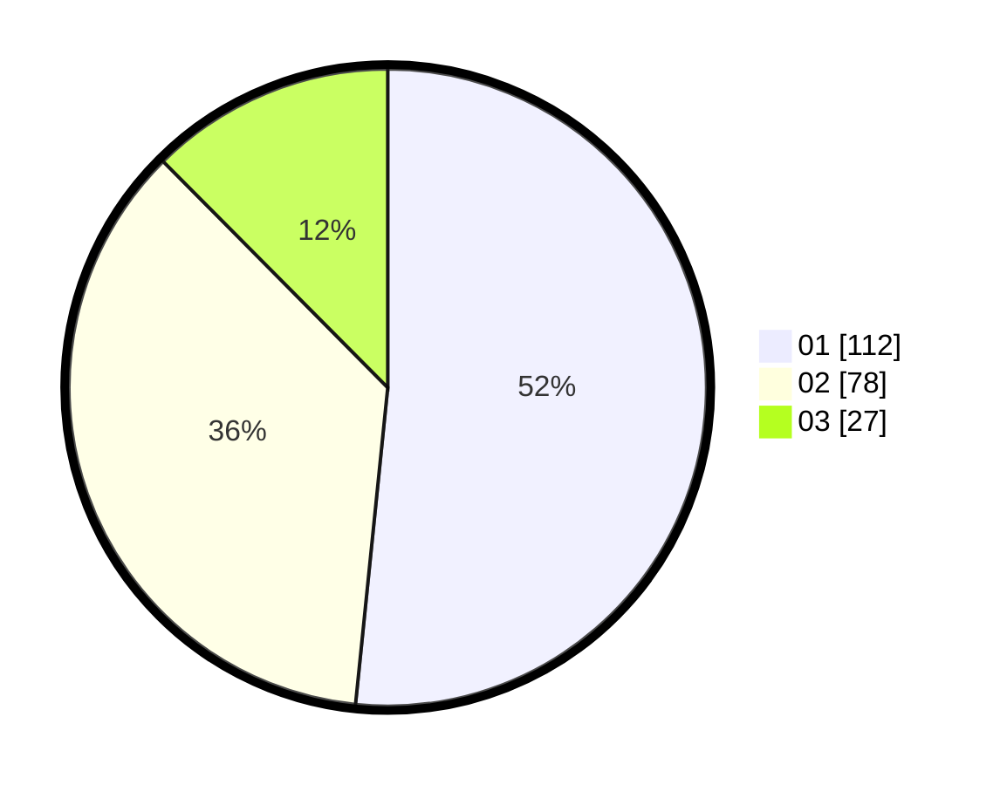

# Hasil

Hasil perolehan suara paslon dapat dilihat pada file paslon-01.txt, paslon-02.txt, dan paslon-03.txt.

Jika tidak ada, artinya data tersebut belum ada pada SIREKAP.

## Perolehan Suara

 * Paslon 01: **112**.
 * Paslon 02: **78**.
 * Paslon 03: **27**.

## Foto C Plano

https://sirekap-obj-formc.kpu.go.id/6b37/pemilu/ppwp/31/74/08/10/05/3174081005011-20240218-140058--88d303b1-cdef-4f34-8550-6c6b91de3493.jpg

https://sirekap-obj-formc.kpu.go.id/6b37/pemilu/ppwp/31/74/08/10/05/3174081005011-20240218-140510--54bc446f-a806-4513-a508-3b7d1ce22b02.jpg

https://sirekap-obj-formc.kpu.go.id/6b37/pemilu/ppwp/31/74/08/10/05/3174081005011-20240218-142105--c9aab5e2-bc85-4476-aedd-21645cbda2dc.jpg

## DATA PEMILIH TETAP

Jumlah pemilih dalam DPT: **279**.
 * L: **141**.
 * P: **138**.

## DATA PENGGUNA HAK PILIH

Jumlah pengguna hak pilih dalam DPT: **213**.
 * L: **101**.
 * P: **112**.

Jumlah pengguna hak pilih dalam DPTb: **2**.
 * L: **1**.
 * P: **1**.

Jumlah pengguna hak pilih dalam DPK: **3**.
 * L: **3**.
 * P: **0**.

Jumlah pengguna hak pilih: **218**.
 * L: **105**.
 * P: **113**.

## JUMLAH SUARA SAH DAN TIDAK SAH

JUMLAH SELURUH SUARA SAH: **217**.

JUMLAH SUARA TIDAK SAH: **1**.

JUMLAH SELURUH SUARA SAH DAN SUARA TIDAK SAH: **218**.
