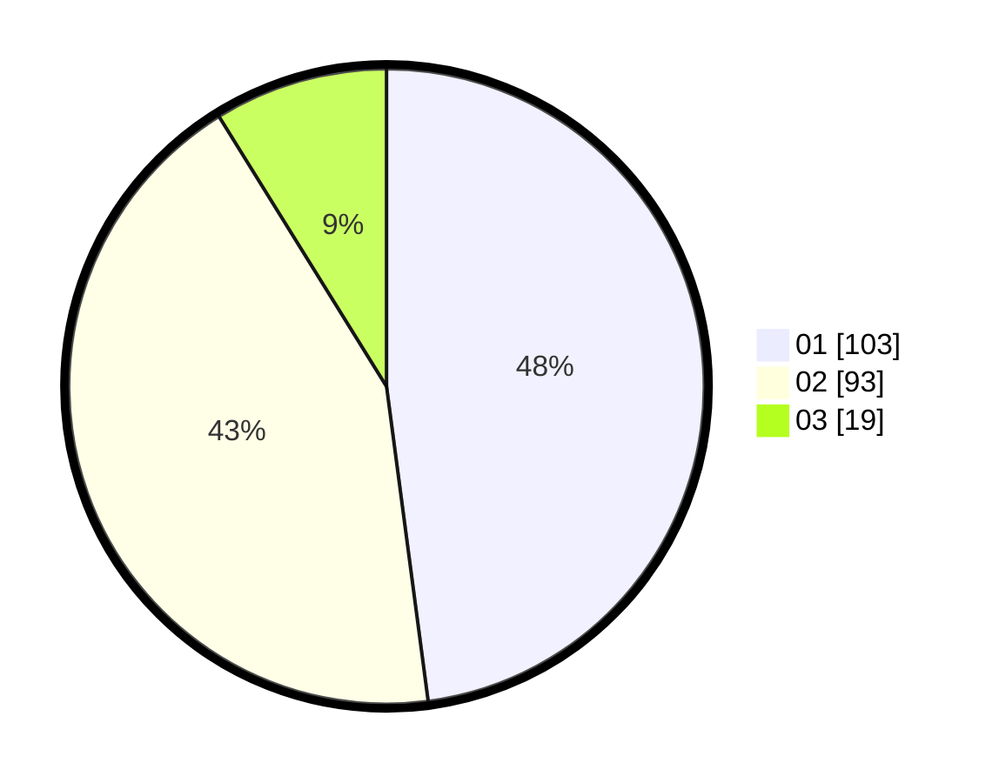

# Hasil

Hasil perolehan suara paslon dapat dilihat pada file paslon-01.txt, paslon-02.txt, dan paslon-03.txt.

Jika tidak ada, artinya data tersebut belum ada pada SIREKAP.

## Perolehan Suara

 * Paslon 01: **103**.
 * Paslon 02: **93**.
 * Paslon 03: **19**.

## Foto C Plano

https://sirekap-obj-formc.kpu.go.id/c2f0/pemilu/ppwp/31/74/08/10/05/3174081005015-20240214-192742--c203ff76-346f-41c1-a7bf-592bd7e3971d.jpg

https://sirekap-obj-formc.kpu.go.id/c2f0/pemilu/ppwp/31/74/08/10/05/3174081005015-20240214-192829--2419d34f-037d-415b-8525-87620f87b8cb.jpg

https://sirekap-obj-formc.kpu.go.id/c2f0/pemilu/ppwp/31/74/08/10/05/3174081005015-20240214-192914--77b72db7-4bd8-42e8-ac3c-c58a46a32d14.jpg

## DATA PEMILIH TETAP

Jumlah pemilih dalam DPT: **287**.
 * L: **152**.
 * P: **135**.

## DATA PENGGUNA HAK PILIH

Jumlah pengguna hak pilih dalam DPT: **214**.
 * L: **110**.
 * P: **104**.

Jumlah pengguna hak pilih dalam DPTb: **3**.
 * L: **1**.
 * P: **2**.

Jumlah pengguna hak pilih dalam DPK: **1**.
 * L: **0**.
 * P: **1**.

Jumlah pengguna hak pilih: **218**.
 * L: **111**.
 * P: **107**.

## JUMLAH SUARA SAH DAN TIDAK SAH

JUMLAH SELURUH SUARA SAH: **215**.

JUMLAH SUARA TIDAK SAH: **3**.

JUMLAH SELURUH SUARA SAH DAN SUARA TIDAK SAH: **218**.
