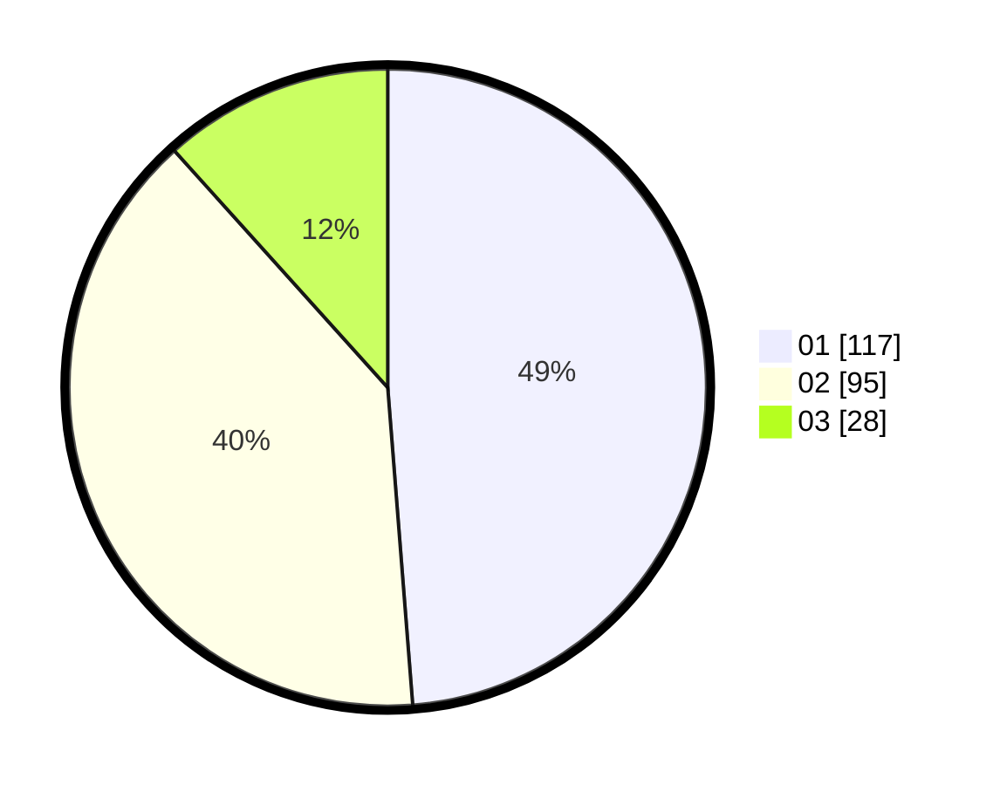

# Hasil

Hasil perolehan suara paslon dapat dilihat pada file paslon-01.txt, paslon-02.txt, dan paslon-03.txt.

Jika tidak ada, artinya data tersebut belum ada pada SIREKAP.

## Perolehan Suara

 * Paslon 01: **117**.
 * Paslon 02: **95**.
 * Paslon 03: **28**.

## Foto C Plano

https://sirekap-obj-formc.kpu.go.id/1aa9/pemilu/ppwp/31/74/08/10/05/3174081005020-20240218-212830--d79c3318-67ed-40fa-94ea-9b0997ff7633.jpg

https://sirekap-obj-formc.kpu.go.id/1aa9/pemilu/ppwp/31/74/08/10/05/3174081005020-20240218-213958--b80340f5-f4a0-4152-b27c-024fe35bbb2a.jpg

https://sirekap-obj-formc.kpu.go.id/1aa9/pemilu/ppwp/31/74/08/10/05/3174081005020-20240218-214245--250ee10f-bf83-48ac-96ae-82802b2e452c.jpg

## DATA PEMILIH TETAP

Jumlah pemilih dalam DPT: **296**.
 * L: **149**.
 * P: **147**.

## DATA PENGGUNA HAK PILIH

Jumlah pengguna hak pilih dalam DPT: **226**.
 * L: **104**.
 * P: **122**.

Jumlah pengguna hak pilih dalam DPTb: **1**.
 * L: **0**.
 * P: **1**.

Jumlah pengguna hak pilih dalam DPK: **5**.
 * L: **2**.
 * P: **3**.

Jumlah pengguna hak pilih: **232**.
 * L: **106**.
 * P: **126**.

## JUMLAH SUARA SAH DAN TIDAK SAH

JUMLAH SELURUH SUARA SAH: **240**.

JUMLAH SUARA TIDAK SAH: **5**.

JUMLAH SELURUH SUARA SAH DAN SUARA TIDAK SAH: **245**.
